# 📊 Chapter 8: Investing in Transmissiondfo

## 🎯 Fundamentals of Power System Economics

### _Coordinating Generation and Transmission in Competitive Markets_

### _Eng. Mahomoud M. Elkholy_

---

## 📋 Table of Contents

1. **Introduction** - Why Transmission Investment Matters
2. **Nature of Transmission Business** - Key Characteristics
3. **Cost-based Transmission Expansion** - Traditional Approach
4. **Short-run Marginal Cost & Investment** - Market-based Approach
5. **Reference Network Concept** - Optimal Design Framework
6. **Mathematical Formulation** - Security Constrained OPF
7. **Case Studies & Examples** - Real-world Applications
8. **Problems & Challenges** - Implementation Issues

---

## 🌟 Introduction

<div class="key-point">

### 🎯 **Core Challenge**

How to coordinate transmission and generation investments in competitive electricity markets while ensuring:

- ✅ Economic efficiency
- ✅ System reliability
- ✅ Fair cost allocation
- ✅ Adequate investment incentives

</div>

### 🔄 The Coordination Problem

- **Before deregulation**: Vertical integration ensured coordination
- **After deregulation**: Separation requires market mechanisms
- **Solution**: Efficient transmission pricing mechanisms

---

## 🏗️ Nature of the Transmission Business

### 🔍 Key Characteristics

<div class="highlight">

### 🏢 **Natural Monopoly**

- Minimum efficient scale is very large
- Environmental constraints prevent competition
- Regulatory oversight essential

</div>

### 💰 **Capital Intensive Business**

- High upfront investment costs
- Low operating costs
- Investment decisions are critical

---

## 🏗️ Transmission Business Characteristics (Cont.)

### ⏰ **Long Asset Life**

- 20-40 years or longer
- Economic conditions change significantly
- Forecasting becomes challenging

### 🚫 **Irreversible Investments**

- Cannot be redeployed elsewhere
- Low resale value
- **Stranded investment** risk

<div class="warning">

**Stranded Investment**: Large investment not used as much as initially expected due to unforeseen changes in demand.

</div>

---

## 🏗️ Transmission Business Characteristics (Cont.)

<div class="two-column">
<div class="content-left">

### 📦 **Lumpy Investments**

- Standardized equipment ratings
- Cannot exactly match demand
- Large, infrequent investments

### 📈 **Economies of Scale**

- Fixed costs independent of capacity
- Average cost decreases with capacity
- Right-of-way costs are significant

</div>
<div class="figure-right">

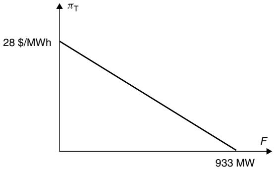

</div>
</div>

---

## 💰 Cost-based Transmission Expansion

### 🔄 Traditional Regulatory Process

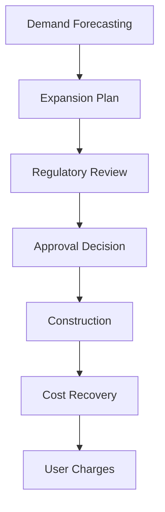

### ⚖️ **Key Trade-offs**

- **Too much capacity**: Higher user charges
- **Too little capacity**: Higher energy prices due to congestion

---

## 💰 Cost Allocation Methods

<div class="single-column">

### 1. Postage Stamp Method characteristics

- Fixed charge regardless of location
- Based on MW rating or peak demand
- Simple but not cost-reflective
- **Problem**: Cross-subsidization

### 2. Contract Path Method characteristics

- Payment for specific transmission path
- More cost-reflective appearance
- **Problem**: Power doesn't follow contract path (Kirchhoff's laws)

</div>

</div>

---

## 💰 Cost Allocation Methods (Cont.)

<div class="single-column">

## **3. MW-Mile Method**

<div class="formula">

**Process:**

1. Calculate actual power flows
2. Determine MW-miles for each transaction
3. Multiply by per-unit transmission cost
4. **Problem**: Results depend on base case and evaluation order

</div>

<div class="warning">

**Issue**: All embedded cost methods have limitations in competitive markets where cost-reflective pricing is essential.

</div>

</div>

---

## 📊 Short-run Marginal Cost and Investment

### 💡 **SRMC-based Pricing Framework**

<div class="key-point">

#### 🎯 **Core Principle**

Locational Marginal Pricing (LMP) combined with Financial Transmission Rights (FTRs) can guide efficient transmission investment decisions.

</div>

#### 🔄 **The Connection**

- Short-term price signals → Long-term investment incentives
- Congestion surplus → Investment recovery mechanism
- Price differentials → Value of transmission capacity

---

## 📈 Two-Bus System Example

<div class="two-column">
<div class="content-left">

### 🔢 **Basic Setup**

- **Bus A**: Lower cost generation
- **Bus B**: Higher cost generation
- **Transmission line**: Limited capacity

#### 💰 **Without Transmission Constraint**

```text
Price_A = Price_B = System Marginal Cost
```

#### ⚡ **With Transmission Constraint**

```text
Price_A < System Marginal Cost < Price_B
Congestion Surplus = (Price_B - Price_A) × Flow
```

</div>
<div class="figure-right">

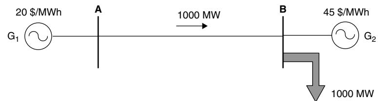

</div>
</div>

---

## 📊 Transmission Value Calculation

<div class="two-column">
<div class="content-left">

### 🎯 **Marginal Value of Transmission**

<div class="formula">

For the two-bus system with:

- **MC_A = 20 + 0.03P_A** $/MWh
- **MC_B = 15 + 0.02P_B** $/MWh

The marginal value equals the price differential between buses when the line is fully utilized.

</div>

#### 📈 **Demand Function for Transmission**

Shows relationship between transmission capacity and its economic value

</div>
<div class="figure-right">

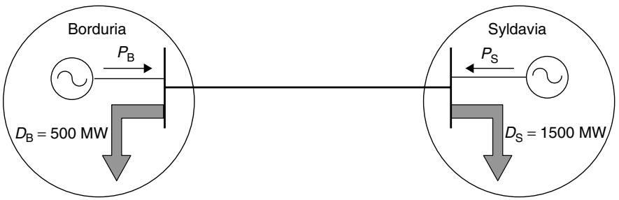

</div>
</div>

---

## ⚖️ Optimal Transmission Investment

### 🎯 **Investment Criterion**

<div class="formula">

**Optimal Capacity T\***:

```
Marginal Benefit = Marginal Cost
```

Where:

- Marginal Benefit = Reduction in congestion cost
- Marginal Cost = Annualized investment cost per MW

</div>

### 💰 **Annualized Investment Cost**

```
C_v(T) = k × l × T
```

Where: **k** = Cost per MW·km·year, **l** = Line length (km), **T** = Transmission capacity (MW)

---

## 📊 Load Duration Curve Analysis

<div class="two-column">
<div class="content-left">

<div class="key-point">

### 🔄 **Multi-Period Analysis**

Investment decisions must consider:

- Peak load periods (high congestion value)
- Off-peak periods (lower congestion value)
- Duration of each period
- Annual cost-benefit calculation

</div>

### 📈 **Annual Congestion Surplus**

```text
CS_annual = Σ(CS_hourly × Duration_period)
```

</div>
<div class="figure-right">

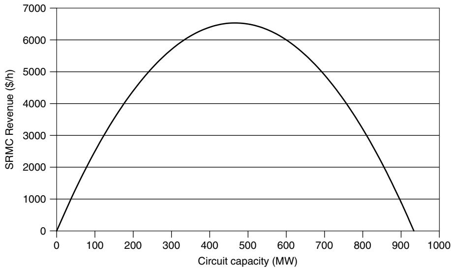

</div>
</div>

---

## 💡 Congestion Revenue vs Investment Cost

<div class="two-column">
<div class="content-left">

### 📊 **Investment Scenarios**

#### 1️⃣ **Optimal Investment**

- Revenue = Cost
- Perfect balance

#### 2️⃣ **Over-investment**

- Revenue < Cost
- Insufficient recovery

#### 3️⃣ **Under-investment**

- Revenue > Cost
- Excess from congestion

</div>
<div class="figure-right">

<div class="key-point">

### **Key Insight**

Market signals guide optimal capacity through price differentials.

</div>

</div>
</div>

---

## 🏗️ Economies of Scale Effects

### 💰 **Total Investment Cost**

<div class="formula">

```
C_T(T) = C_F + C_V(T)
```

Where: **C_F** = Fixed cost (independent of capacity), **C_V(T)** = Variable cost (proportional to capacity)

</div>

### 🎯 **Key Insight**

- Fixed costs don't affect optimal capacity decision
- But they affect revenue adequacy
- May require capacity withholding to increase revenue

<div class="warning">

**Challenge**: How to recover fixed costs while maintaining efficiency?

</div>

---

## 🔗 Three-Bus System Complexity

<div class="two-column">
<div class="content-left">

<div class="highlight">

### ⚡ **Kirchhoff's Law Effects**

- Power flows follow physical laws, not contracts
- Congestion on one line affects prices throughout network
- Individual line revenues don't match individual line costs
- **Total** congestion surplus equals **total** investment cost

</div>

</div>
<div class="figure-right">

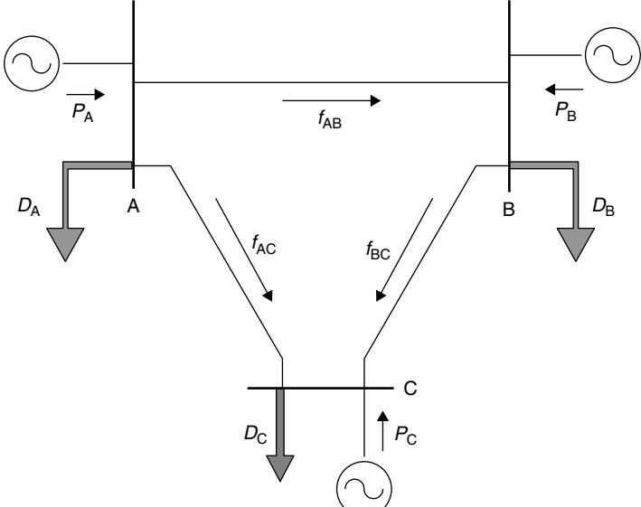

</div>
</div>

---

## 📊 Three-Bus System Results

<div class="two-column">
<div class="content-left">

### 🔢 **Optimal Generation Dispatch**

#### 📈 **Period 1 (Low Load)**

Shows the optimal generation dispatch for low load conditions with minimal congestion.

### E 📈 **Period 2 (High Load)**

Demonstrates how increased load leads to transmission constraints and different pricing patterns.

</div>
<div class="figure-right">

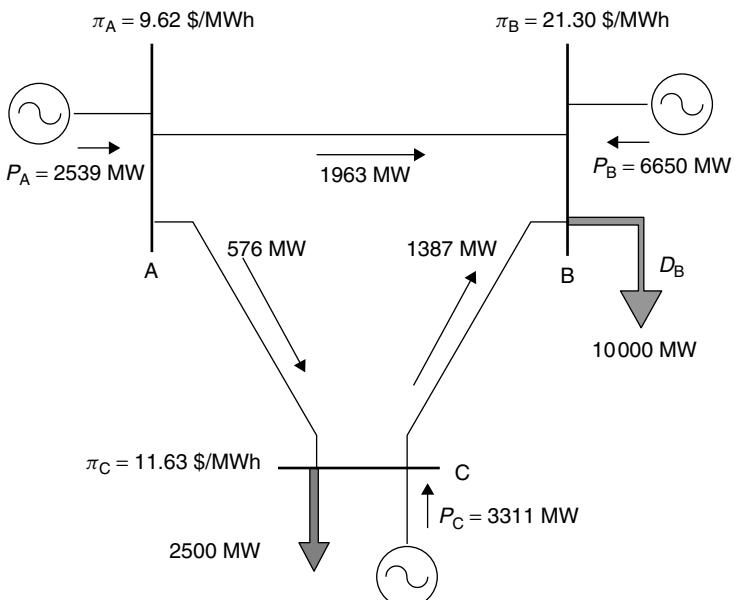

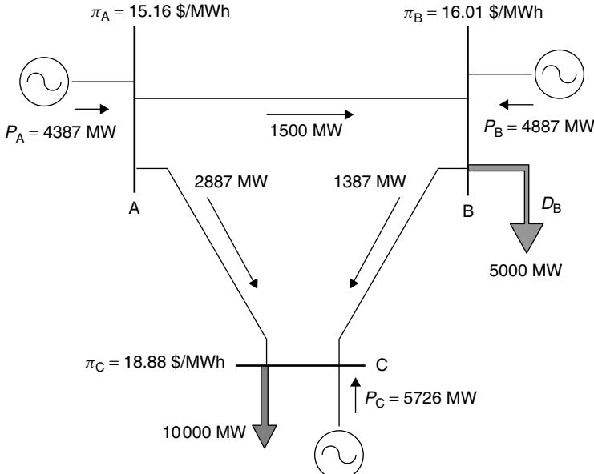

</div>
</div>

---

## 📋 Three-Bus System Analysis

### 💰 **Key Financial Results**

| Line      | Capacity (MW) | Revenue ($/h) | Investment Cost ($/h) |
| --------- | ------------- | ------------- | --------------------- |
| A-B       | 1,963         | 6,688         | 6,723                 |
| A-C       | 2,887         | 8,344         | 9,887                 |
| B-C       | 1,387         | 6,339         | 4,750                 |
| **Total** | -             | **21,360**    | **21,360**            |

<div class="key-point">

### ✅ **Key Result**

Total congestion surplus exactly equals total investment cost, even though individual lines may not achieve cost recovery.

</div>

---

## 🎯 Reference Network Concept

<div class="key-point">

### 💡 **Definition**

A reference network is topologically identical to the existing network, but with **optimal** transmission line capacities determined by minimizing total system cost.

</div>

#### 🎯 **Purpose**

- Benchmark for regulatory performance
- Identify investment needs
- Detect stranded investments
- Set performance incentives

#### 📊 **Applications**

- Transmission planning
- Rate setting
- Performance measurement
- Investment prioritization

---

## 🔢 Mathematical Formulation

<div class="single-column">

### 🎯 **Security Constrained OPF**

<div class="formula">

#### **Objective Function:**

```math
\min \sum(\tau_p \times \sum(C_g \times P_{pg})) + \sum(k_b \times l_b \times T_b)
```

**Subject to:**

- Power balance: `A⁰F_p⁰ - P_p + D_p = 0`
- Flow equations: `F_p⁰ = H⁰(P_p - D_p)`
- Capacity limits: `|F_p⁰| ≤ T`
- Generation limits: `P^min ≤ P_p ≤ P^max`
- Security constraints for all contingencies

</div>

</div>

---

## 🔄 Implementation Algorithm

<div class="two-column">
<div class="content-left">

🔄 **Iterative Process**

1. **Initialize**: No transmission constraints
2. **Solve OPF**: Optimal dispatch and capacities
3. **Check Security**: Power flow for all contingencies
4. **Add Constraints**: For overloaded lines
5. **Repeat**: Until no violations
6. **Calculate Prices**: Using Lagrange multipliers

</div>
<div class="figure-right">

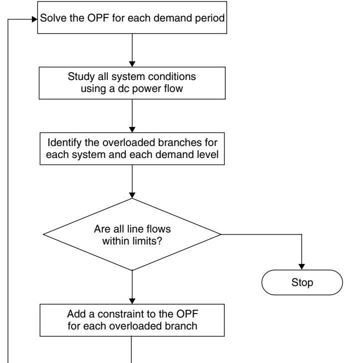

</div>
</div>

---

## 📊 IEEE RTS Case Study

<div class="two-column">
<div class="content-left">

## 🏗️ **24-Bus Test System**

### 📈 **Security vs Transport Requirements**

<div class="highlight">

### 🔍 **Key Observation**

Most lines require much higher capacity for security than for pure transport, confirming the importance of reliability in transmission design.

</div>

</div>
<div class="figure-right">

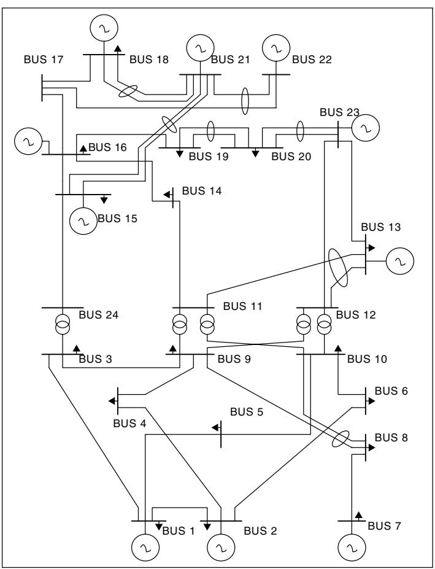

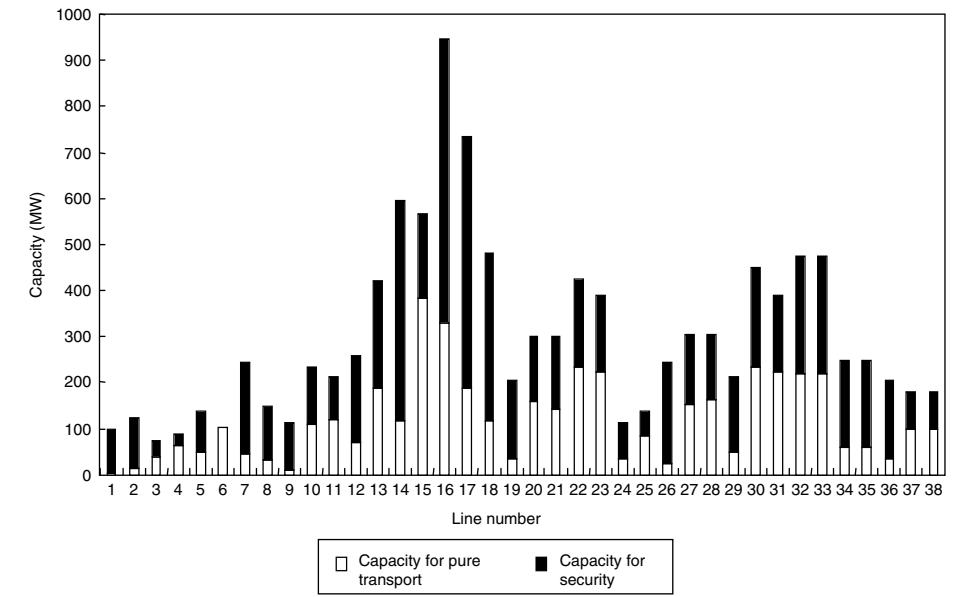

</div>
</div>

---

## ⚖️ Nodal Price Calculation

<div class="formula">

#### **Nodal Price Formula:**

```
π_j^p = π^p + Σ Σ (h_jb^s × μ_b^ps)
      s=1 b=1
```

Where:

- **π^p** = System marginal cost for period p
- **h_jb^s** = Sensitivity factor (line b, bus j, scenario s)
- **μ_b^ps** = Shadow price of transmission constraint

</div>

#### 💡 **Economic Interpretation**

- Base energy cost + transmission congestion cost
- Location-specific pricing
- Reflects system constraints and security requirements

---

## 🚀 Advanced Considerations

### 🔮 **Additional Complexity Factors**

<div class="highlight">

#### 🎯 **Network Design Optimization**

- Topology optimization
- Voltage level selection
- New transmission technologies (FACTS)

#### 📈 **Dynamic Factors**

- Load growth projections
- Distributed generation
- Demand-side management
- Storage integration

</div>

---

## 🚀 Advanced Considerations (Cont.)

### ⚡ **Technical Constraints**

<div class="formula">

#### 🔌 **Power System Constraints**

- Transmission losses
- Reactive power requirements
- Voltage stability limits
- Transient stability constraints
- Generation reserve requirements

</div>

<div class="warning">

**Note**: The basic reference network model can be extended to include these factors, but complexity increases significantly.

</div>

---

## 📚 Key Takeaways

<div class="key-point">

### 🎯 **Main Insights**

1. **Coordination Challenge**: Separation of generation and transmission requires market mechanisms
2. **SRMC Pricing**: Can provide investment signals through congestion surplus
3. **Revenue Adequacy**: Total congestion surplus equals optimal investment cost
4. **Individual vs System**: Line-by-line cost recovery may not work, but system-wide does
5. **Security Matters**: Reliability requirements significantly affect optimal capacity
6. **Reference Network**: Provides objective benchmark for regulation and planning

</div>

---

## ⚠️ Implementation Challenges

### 🚧 **Practical Issues**

<div class="warning">

#### 🔍 **Revenue Allocation**

- How to allocate congestion surplus among individual lines?
- FTR design becomes complex in meshed networks
- Cross-subsidization between lines

#### 🏢 **Merchant Transmission**

- Individual line profitability unclear
- Network effects complicate investment decisions
- Regulatory vs market-based approaches

</div>

---

## ⚠️ Implementation Challenges (Cont.)

### 🎯 **Regulatory Challenges**

<div class="highlight">

#### 📊 **Performance Measurement**

- How to measure transmission company efficiency?
- Setting appropriate investment incentives
- Balancing reliability and cost

#### 🔄 **Transition Issues**

- From embedded cost to SRMC pricing
- Existing contract obligations
- Stranded cost recovery

</div>

---

## 🎓 Problem Set Overview

### 📝 **Chapter 8 Problems**

#### 🔍 **Problem Types**

1. **Regulatory Analysis** (8.1-8.2)

   - Transmission expansion processes
   - Cost allocation methods

2. **Two-Bus Calculations** (8.3-8.9)
   - Transmission pricing
   - Optimal capacity determination
   - Revenue adequacy analysis

#### 🎯 **Example Problem**

Given marginal costs MC_A = 25 $/MWh and MC_B = 17 $/MWh, what is the maximum transmission price?

**Answer**: Price differential = 25 - 17 = 8 $/MWh

---

## 📊 Problem Set - Load Duration Curve

### 📈 **Three-Period Analysis**

| Period | Load A (MW) | Load B (MW) | Duration (h) |
| ------ | ----------- | ----------- | ------------ |
| High   | 4,000       | 2,000       | 1,000        |
| Medium | 2,200       | 1,100       | 5,000        |
| Low    | 1,000       | 500         | 2,760        |

#### 🎯 **Analysis Requirements**

- Calculate optimal transmission capacity
- Compare congestion revenue with investment cost
- Analyze over/under-investment scenarios (±33.3%)

---

## 🔚 Conclusion

<div class="key-point">

### 🎯 **Future of Transmission Investment**

The challenge of coordinating transmission and generation investment in competitive markets requires:

#### 🚀 **Innovation Areas**

- Advanced market mechanisms
- Smart grid technologies
- Energy storage integration
- Renewable energy accommodation

#### ⚖️ **Policy Development**

- Improved regulatory frameworks
- Regional coordination mechanisms
- Environmental consideration integration

</div>

---

## 📖 Further Reading

### 📚 **Essential References**

- **Boiteux, M** (1949): Foundational work on marginal cost pricing
- **Hogan, W W** (1999, 2003): Market-based transmission investments
- **Farmer et al.** (1995): Optimal pricing of transmission services
- **Marangon Lima** (1996): Transmission cost allocation overview
- **Wood & Wollenberg** (1996): Power system operation and control

### 🌐 **Online Resources**

- Harvard Kennedy School: <www.ksg.harvard.edu/whogan>
- IEEE Power & Energy Society publications
- Regional transmission organization reports

---

## ❓ Questions & Discussion

<div class="highlight">

## 💭 **Discussion Topics**

1. How can merchant transmission work in practice given network effects?

2. What role should government play in transmission investment?

3. How do renewable energy resources change transmission planning?

4. Can artificial intelligence improve transmission investment decisions?

5. What are the environmental considerations in transmission expansion?

</div>

### 🎯 **Thank you for your attention!**

---
