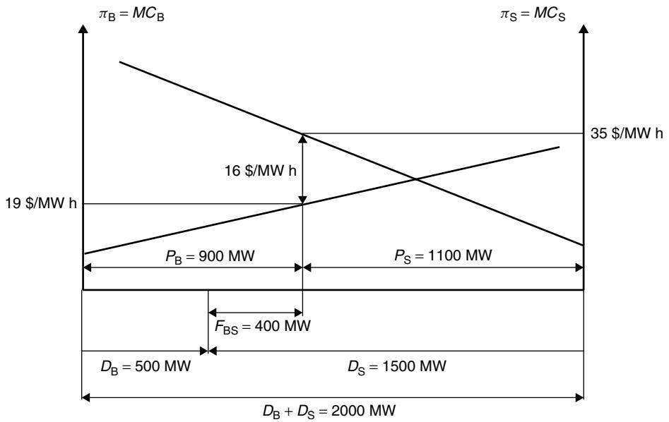
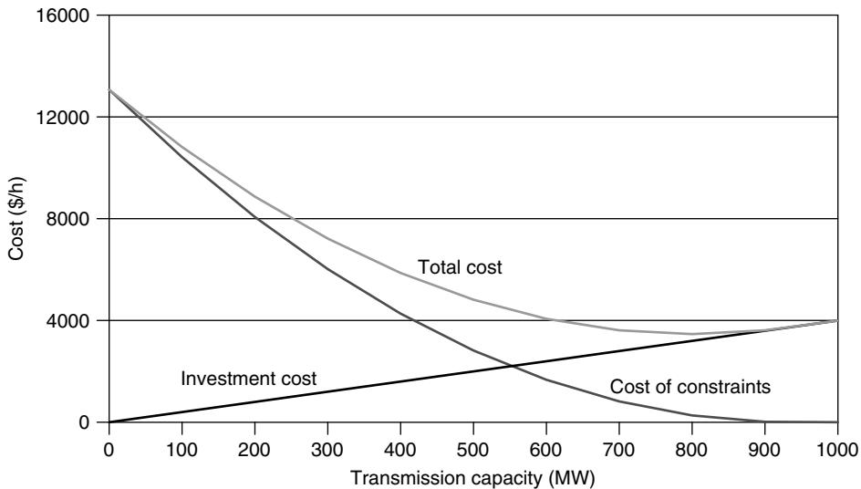
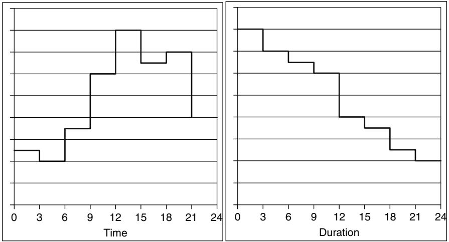
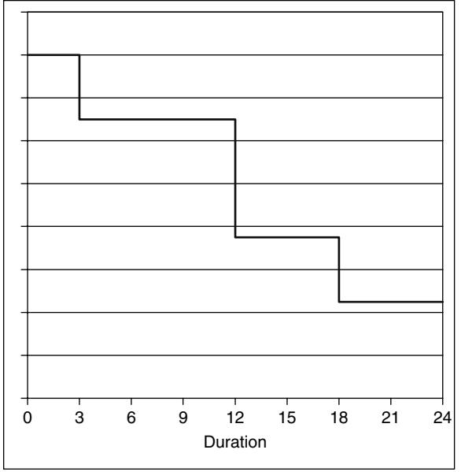
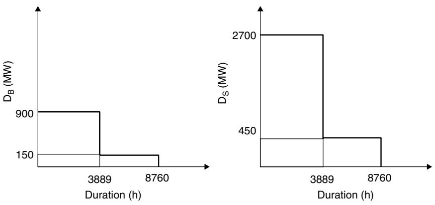
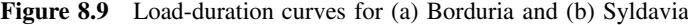
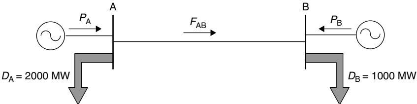

# 8 Investing in Transmission

# **8.1 Introduction**

In Chapter 6, we studied the effect that an existing transmission network has on electricity markets. Expanding this transmission network through the construction of new lines or the upgrade of existing facilities increases the amount of power that can be traded securely and the number of generators and consumers that can take part in this market. Transmission expansion thus enhances the competitiveness of the market. On the other hand, investments in new transmission equipment are costly and should therefore be undertaken only if they can be justified economically. In order to deliver maximum economic welfare to society, the electricity supply industry should follow the path of least-cost long-term development. This requires a coordinated approach to the optimization of the generation and transmission operation and development. Optimizing the transmission network in isolation from the generation resources would almost certainly not meet the above objective. Before the introduction of competition, the vertical integration of electric utilities was considered necessary to ensure a sufficient level of coordination.

Among other reasons, competition was introduced in the electricity supply to respond to growing concerns about the inefficiency of established operation and investment practices. One of the consequences of the deregulation process has been the separation of generation from transmission. This separation is indeed frequently considered indispensable to achieve open and nondiscriminatory access to the energy market. In this environment, pricing of transmission becomes the key to achieving both efficient operation and least-cost system development of the entire system. Coordination of investments in generation and transmission, which are now operated as separate entities, is to be achieved through efficient network pricing mechanisms.

Much of the early work on transmission network pricing has focused on shortterm operational efficiency and transmission congestion management. Location specific, short-run marginal cost (SRMC) based pricing is now a well-established method for allocating scarce network resources. Locational marginal prices computed from a bidbased security constrained dispatch and combined with financial transmission rights (FTRs) have been successfully implemented in several major electricity markets.

2004 John Wiley & Sons, Ltd ISBN: 0-470-84572-4

_Fundamentals of Power System Economics_ Daniel Kirschen and Goran Strbac

More recently, the discussion has turned to the need to restructure the framework for investments in the transmission network. This restructuring can be taken along two, possibly complementary, directions: merchant transmission investments and transmission investments based on regulatory incentives.

The first approach starts from the view that market forces are the keys to investment and expansion in transmission. The fundamental function of any transportation business is to buy a product at a low price in one location and sell it at a higher price in another. Transportation is a viable business if the price differential between the two markets is larger than the cost of transporting the product. In principle, the same logic could be applied to transmission of electricity. While locational marginal prices, coupled with FTRs, provide a conceptual framework for merchant transmission investments, a number of theoretical and practical difficulties must still be overcome.

The second approach starts from the premise that transmission networks is inherently a monopoly and hence needs to be regulated. The key responsibility of the regulatory agencies that determine the income of transmission developers is then to organize incentives that encourage an efficient transmission expansion. These incentives should financially reward decisions that increase economic efficiency. They should also penalize inefficient expenditures. Setting the targets that measure efficient operation is particularly difficult with this approach. Allocating the costs and benefits of transmission expansion to all the network users is another major challenge.

Since both of these approaches are still under development, this chapter does not discuss the implementation of either approach but focuses on the theoretical foundations common to both.

After a brief review of the essential characteristics of the transmission business, we discuss the traditional approach to transmission investments where investors are remunerated on the basis of the cost of the installed transmission equipment. We then consider the relationship between short-term locational marginal prices and transmission investment. We also develop the concept of economically adapted or reference transmission network.

# **8.2 The Nature of the Transmission Business**

In liberalized electricity markets, transmission is usually separated from the other components of a traditional, vertically integrated utility. It is therefore useful to begin our discussion of transmission investments by considering some of the characteristics of transmission as a standalone business.

_Rationale for a transmission business_ The transmission business exists only because the generators and loads that use the network are in the wrong place. Market opportunities for transmission increase with the distance that separates producers and consumers. On the other hand, if a reliable and environmentally friendly generation technology became cost effective for domestic installations, the transmission business would probably disappear.

_Transmission is a natural monopoly_ It is currently almost inconceivable that a group of investors would decide to build a completely new transmission network designed to operate in competition with an existing one. Because of their visual impact on the environment, it is indeed most unlikely that the construction of competing transmission

lines along similar routes would be allowed. Furthermore, the minimum efficient size of a transmission network is such that electricity transmission is considered a good example of a natural monopoly.

Like all monopolies that provide an essential service, electricity transmission must be regulated to ensure that it delivers an economically optimal combination of quality of service and price. This is not an objective that is easy to achieve. Even though the consumers and generators pay for using the transmission network, the regulator in essence "buys" transmission capacity on their behalf. Its best judgment about how much capacity is needed thus replaces the multitude of independent purchasing decisions that make up the demand curve in a competitive market.

In exchange for being granted a regional monopoly, a transmission company must accept that the regulatory authorities will determine its revenues. These revenues are usually set in such a way that investors get a relatively modest return on their capital. However, compared to other stock market investments, transmission companies are relatively safe because they do not face competition. In fact, the biggest risk that these companies face is the regulatory risk, that is, the risk that a change in regulatory principles or practices may decrease their allowed revenues.

_Transmission is a capital-intensive business_ Transmitting electric power securely and efficiently over long distances requires large amounts of expensive equipment. While the most visible items of equipment are obviously the aerial transmission lines, the cost of the transformers, switchgear and reactive compensation devices is very high. Maintaining the security of the system while operating it close to its physical limits requires large amounts of protection and communication equipment as well as sophisticated control centers. The cost of these investments is high compared to the recurring cost of operating the system. Making good investment decisions is thus the most important aspect of running a transmission company.

_Transmission assets have a long life_ Most transmission equipment is designed for an expected life ranging from 20 to 40 years or even longer. A lot of things can change over such a long period. Generation plants that were expected to produce the bulk of the demand for electrical energy may become prematurely obsolete because of changes in the cost of fuel or because of the emergence of a competing technology. At the same time, an uneven economic development may shift the geographical distribution of the demand. A transmission line that was built on the basis of erroneous forecasts may therefore be used at only a fraction of its rating.

_Transmission investments are irreversible_ Once a transmission line has been built, it cannot be redeployed in another location where it could be used more profitably. Other types of transmission equipment may be easier to move, but the cost of doing so is often prohibitive. The resale value of installed assets is very low. Owners of transmission networks therefore have to live with the consequences of their investment decisions for a very long time. A large investment that is not used as much as was initially expected is called a _stranded investment_. Investors must therefore analyze what the performance of an asset might be under a wide variety of scenarios. In a regulated environment, they usually get some form of assurance that they will be able to recover the value of their investment even if it becomes stranded because of unforeseen changes in the demand for transmission.

_Transmission investments are lumpy_ Manufacturers sell transmission equipment in only a small number of standardized voltage and MVA ratings. It is therefore often not possible to build a transmission facility whose rating exactly matches the need. While it is occasionally possible to upgrade facilities as demand increases, this standardization and the low resale value of the installed equipment often make this process impractical and economically difficult to justify. Investments in transmission facilities thus occur infrequently and in large blocks. Early in its life, the capacity of a facility tends to exceed the demand. Later on, it is likely to be utilized much more intensively, at least if the situation evolves as forecast.

_Economies of scale_ Ideally, investments should be proportional to the capacity they provide. For transmission lines, this is clearly not the case. The cost of building the line itself is primarily proportional to its length because of the need to acquire the right of way, adapt the terrain and erect the towers. The rating of the line affects the cost only through the size of the conductors and the height that the towers must have to accommodate higher voltages. In addition, new substations must be built at both ends or existing ones must be expanded. This cost is significant and almost independent of the amount of active power that the line can transport. Because of these fixed costs, the average cost of transmitting electricity decreases with the amount transported. Transmission networks thus involve important economies of scale.

_Merchant transmission_ While the overwhelming majority of transmission investments are still remunerated on a regulated basis, over the last several years a few transmission links have been built on a merchant basis. The regional regulated transmission company did not build these links. Instead, an unregulated company provided the capital needed for their construction. Rather than getting a modest but safe rate of return, these unregulated companies hope to obtain much larger revenues through the operation of these links. On the other hand, they carry the risk that these revenues may be insufficient to recover the cost of their investment.

# **8.3 Cost-based Transmission Expansion**

Under the traditional regulatory compromise, regulated transmission companies collect enough revenues to cover the costs of their investment plus a rate of return sufficient to attract capitalists seeking a relatively safe investment. While this approach is conceptually simple, we need to explore two important questions:

- How much transmission capacity should be built?
- How should the cost of transmission be allocated among the users of the transmission network?

### **8.3.1 Setting the level of investment in transmission capacity**

Under the traditional model, investments in transmission facilities are carried out according to a process that typically works as follows:

• Using demographic and economic projections, the transmission company forecasts the needs for transmission capacity.

- On the basis of this forecast, it prepares an expansion plan that it submits to the regulatory authorities.
- The regulatory authorities review this plan and decide which facilities may be built or upgraded.
- The transmission company builds these new facilities using the capital provided by its shareholders or its bondholders.
- Once the new facilities are commissioned, the transmission company begins recovering the cost of these investments through the charges that users of the network have to pay.

The price that consumers pay for electricity is clearly a function of the capacity of the transmission network. If the regulator allows the transmission company to build too much transmission capacity, the users pay more for capacity that is not used. On the other hand, if too little capacity is available, congestion in the network reduces trading opportunities, increases prices in some areas and depresses them in others.

In theory, the regulator should try to get it exactly right because too little capacity or too much capacity causes a loss of global welfare. Because of the inevitable uncertainty on the evolution of the demand and the generation, this is not easily achieved. In practice, one might argue that, from an economic perspective, it is better to err on the side of too much transmission capacity. Transmission indeed accounts for only about 10% of the total cost of electricity to consumers. While the cost of overinvesting is not small, the potential cost of underinvesting is much higher because even a small deficit of transmission capacity can have a very large effect on the price of electrical energy, which represents about 60% of the total cost to consumers.

On the other hand, remunerating transmission companies on a rate-of-return basis encourages them to overstate the need for transmission capacity because building more facilities increases the revenue that they are allowed to collect from the users of the network. Regulatory authorities rarely have the manpower and technical expertise required to evaluate expansion plans prepared by the transmission company.

In conclusion, remunerating transmission investments on the basis of their cost keeps the transmission company in business, which is usually in the best interest of all parties involved. This approach also ensures some predictability in the cost of transmitting electricity. On the other hand, it does not guarantee that the level of investment in transmission capacity is economically optimal.

### **8.3.2 Allocating the cost of transmission**

Once the regulator has determined the revenue that the transmission company can collect to recover its investment, this embedded cost must be divided between the producers and consumers that use the transmission network. In the following paragraphs, we briefly discuss the principles of the main allocation methods that have been proposed. Readers interested in the details of these embedded cost methods should consult Marangon Lima (1996).

### **8.3.2.1 Postage stamp method**

Under this method, all users must pay a "use of system charge" to gain access to the network of their local transmission company. This charge usually depends on the megawatt rating of the generating units for a producer or the peak demand for a consumer. It can also factor in the annual energy produced or consumed (in MWh). It may also be a function of the voltage level at which a user is connected to reflect the fact that a user connected directly to the transmission network does not make use of the subtransmission and distribution networks. However, like a postage stamp, this charge usually does not depend on where the energy is coming from or going to, as long as it is within the local system.

The charge that each user pays thus reflects the average usage of the entire network rather than the use of specific transmission facilities. Charges are adjusted proportionally to ensure that the transmission company recovers all the revenue that it is entitled to collect.

Because of its simplicity, this method is the most common charging mechanism for the utilization of the local transmission network. Its main disadvantage is that the charges paid by each user do not reflect the actual use that they make of the network or the value they derive from being connected. In many cases, some users cross-subsidize others. This is not economically desirable because it distorts competition. For example, generators connected close to the main load centers could argue that they should not pay the same charges as remote generators because the energy they produce does not need to transit through long and expensive transmission lines to reach the consumers.

Another problem with the postage stamp approach is that it only covers the cost of using the local transmission network. If a producer wants to sell energy in a neighboring system, it may have to buy an additional postage stamp to get access to the neighboring network. If two trading partners are not located in adjacent networks, each intermediate transmission company may require the purchase of a separate postage stamp. Like in a stack of pancakes, the cost of each stamp may not be very high, but the overall expense may be substantial. This phenomenon is dubbed the "pancaking of rates". It is usually undesirable because the overall charge overestimates the actual cost of transmitting the energy and may make economically justified transactions unprofitable.

### **8.3.2.2 Contract path method**

The contract path method finds its origins in the days when the electricity supply industry consisted mostly of vertically integrated utilities and energy transactions were infrequent. When a consumer wanted to buy energy from a producer other than its local utility, it was still making use of the network of this utility and should therefore bear a proportionate share of the embedded costs of this network. A wheeling contract has to be set up to formalize this arrangement. In this method, the contract specifies an electrically continuous path (the contract path) along which the power is assumed to flow from the generator to the point of delivery. The producer and the consumer agree to pay, for the duration of the contract, a wheeling charge proportional to the amount of power transmitted. This wheeling charge provides part of the revenue that the utility needs to recover the cost of the transmission assets included in the contract path.

The producer and consumer thus pay only for the usage of specific network facilities and not a fraction of the average cost of the entire network. While remaining simple, this method thus appears more cost reflective than the postage stamp approach. In reality, the power traded does not follow only the contract path but a multitude of other paths, as dictated by Kirchhoff's laws. Whether it is truly more cost reflective is thus highly questionable.

### **8.3.2.3 MW-mile method**

With the MW-mile method, power flow calculations are used to determine the actual paths that the power follows through the network. The amount of MW-mile of flow that each transaction causes is calculated. This amount is then multiplied by an agreed per-unit cost of transmission capacity to get the wheeling charge. The method can be refined to take into account the fact that some transactions reduce the flow on some lines. If transmission networks were linear systems, this approach would be rigorous. Unfortunately, they are not. The base case from which transactions are evaluated and the order in which they are considered has a significant and undesirable effect on the results.

### **8.3.2.4 Comments on the embedded cost allocation methods**

All the methods discussed above have been criticized because they lack a credible foundation in economic theory. In particular, they produce charges that are proportional to the average rather than the incremental cost of the network. This means that they do not provide correct economic signals. Nevertheless, because of their simplicity and ease of implementation, they have been used extensively, mainly in the United States.

# **8.4 Value-based Transmission Expansion**

In a competitive electricity market, transmission can be viewed as being in competition with generation. The transmission network indeed allows remote generators to compete with local ones. We can thus estimate the value of transmission on the basis of the differences in the marginal cost or price of generation across the network. This value provides a sound basis for setting the price that producers and consumers should pay to use the network.

### **8.4.1 Quantifying the value of transmission**

### **8.4.1.1 A first example**

Let us consider the two-bus, one-line system shown in Figure 8.1. For the sake of simplicity, we neglect losses and ignore security considerations. We also assume that the capacity of both generators is such that each of them can supply the 1000 MW load

**Figure 8.1** Simple example illustrating the value of transmission

on its own. Finally, we assume that the capacity of the transmission line is sufficient to support any power transmission that may be required.

The consumers at bus B can either buy energy at 45 \$/MWh from the local generator G2 or buy energy at 20 \$/MWh from the remote generator G1 and pay for the transmission of this energy. If the cost of this transmission is less than 25 \$/MWh, consumers will choose to buy their energy from generator G1 because the overall cost would be less than the 45 \$/MWh that they would have to pay to buy energy from generator G2.

It is thus not in the best interest of the owner of the transmission line to charge more than 25 \$/MWh because such a charge would discourage consumers from making use of the transmission system. In this example, the value of the transmission service is thus 25 \$/MWh because, at that price, consumers are indifferent between using and not using transmission. The value of transmission is thus a function of the short-run marginal cost of generation. In this case, this function is very simple because there is no limit to the substitution between transmission and local generation.

We can also look at the problem from an investment perspective. This transmission line should be built only if its amortized cost amounts to less than 25 \$/MWh.

If the maximum output of the local generators is less than 1000 MW, the transmission line must be used to supply the load. The value of transmission is then no longer determined by the price of local generation but by the consumers' willingness to pay for electrical energy. In the short term, this could be significantly higher than 25 \$/MWh. Limitations on local generation place the transmission provider in a monopoly position because the consumers have a choice between using transmission and giving up consumption. This monopoly position may not be sustainable in the long run because it would encourage the development of local generation.

### **8.4.1.2 A second example**

We will now revisit the Borduria/Syldavia example that we introduced in Chapter 6. In that chapter, we studied the effect that the operation of this interconnection has on market prices. We will now determine the optimal capacity of this interconnection.

Our model for this interconnected system is the same as the one we used in Chapter 6 and is shown in Figure 8.2. The only difference is that the capacity of the interconnection is not fixed. Our starting point is the economic characteristics of the two markets when they operate independently. We saw that the supply functions for the electricity markets in Borduria and Syldavia are respectively

$$
\pi\_{\rm B} = MC\_{\rm B} = 10 + 0.01 P\_{\rm B} \text{ \(\prime\)}\text{MWh} \tag{8.1}
$$

$$
\pi\_{\rm S} = MC\_{\rm S} = 1\,\text{\AA} + 0.02 P\_{\rm S} \,\text{\AA}\text{Wh} \,\text{h} \tag{8.2}
$$

**Figure 8.2** Model of the Borduria/Syldavia interconnection

The demands in Borduria and Syldavia are respectively 500 MW and 1500 MW. We continue to assume that these demands do not vary with time and are perfectly inelastic.

In the absence of an interconnection, the two national electricity markets operate independently and the prices in Borduria and Syldavia are respectively 15 \$/MWh and 43 \$/MWh. The value of transporting the first megawatt-hour from Borduria to Syldavia is thus equal to the difference in price between the two countries, that is, 28 \$/MWh.

We saw in Chapter 6 that when the flow through the interconnection is 400 MW, generators in Borduria produce 900 MW. 500 MW of this production is for the local load, while the remaining 400 MW is sold to consumers in Syldavia. The remaining 1100 MW of Syldavian load is produced locally. Under these conditions, the prices in Borduria and Syldavia are 19 \$/MWh and 35 \$/MWh respectively. The value of transporting one additional megawatt-hour from Borduria to Syldavia is thus only 16 \$/MWh. This is also the maximum price that consumers in Syldavia would agree to pay for the transport of a megawatt-hour that they have bought in Borduria for 19 \$/MWh. If the price of transmission were any higher, they would prefer to buy this megawatt-hour from local generators.

When the flow on the interconnection reaches 933.3 MW, the prices in Borduria and Syldavia are equal:

$$
\pi = \pi\_{\mathsf{B}} = \pi\_{\mathsf{S}} = 24.30 \text{ \\$/MWh} \tag{8.3}
$$

At that point, the marginal value of transmission is zero because Syldavian consumers can buy one extra megawatt-hour from local generators at the same price that they would pay for a megawatt-hour purchased on the Bordurian market. They would therefore not be willing to pay anything for the transmission of this incremental energy. There is also no reason to increase the power transfer between the two countries any further because that would make the marginal value of transmission negative. Transmitting more power would require an increase in production in Borduria and would make the price of energy on that market higher than the price in Syldavia. The interconnection would then be transmitting energy from a higher-priced location to a lower-priced location. This would obviously be wasteful and economically inefficient. We can thus conclude that the marginal value of transmission is a function of the magnitude of the flow, which in turn depends on the energy prices and the capacity of the transmission network.

### **8.4.2 The transmission demand function**

We will now formalize the observations that we made in the examples above by introducing a demand function for transmission. This function gives the value of transmission in terms of the amount of power _F_ transmitted between Borduria and Syldavia.

$$
\pi\_\mathsf{T}(F) = \pi\_\mathsf{S}(F) - \pi\_\mathsf{B}(F) \tag{8.4}
$$

where _π_T_(F )_ is the value of the transmission. The prices of electrical energy in Syldavia and Borduria, _π_S_(F )_ and _π_B_(F )_ are expressed in terms of the power transmitted. Substituting (8.1) and (8.2) into (8.4) we obtain

$$\pi\_{\rm T}(F) = (13 + 0.02P\_{\rm S}(F)) - (10 + 0.01P\_{\rm B}(F))$$

$$= 3 + 0.02P\_{\rm S}(F) - 0.01P\_{\rm B}(F) \tag{8.5}$$

The production of the generators in Borduria and Syldavia can be expressed in terms of the flow on the interconnection and the local demands as follows:

$$P\_{\mathbb{B}}(F) = D\_{\mathbb{B}} + F \tag{8.6}$$

$$P\_{\mathbb{S}}(F) = D\_{\mathbb{S}} - F \tag{8.7}$$

Equation (8.5) thus becomes

$$
\pi\_\Gamma(F) = \mathfrak{Z} + 0.02(D\_\mathbb{S} - F) - 0.01(F + D\_\mathbb{B}) \tag{8.8}
$$

Substituting the known values for the demands, we get

$$
\pi\_\mathbb{T}(F) = 28 - 0.03F \tag{8.9}
$$

Using this expression, we can check the results that we obtained above in an ad hoc manner. In particular, we see that when the flow is equal to zero, the price of transmission is 28 \$/MWh. Conversely, the transmission price drops to zero when the flow reaches 933.3 MW, which is the value of the flow for which the prices of generation in Borduria and Syldavia are equal.

Equation (8.9) can be inverted to get the demand for transmission as a function of its price:

$$F(\pi\_{\rm T}) = 933.3 - 33.3\pi\_{\rm T} \tag{8.10}$$

As Figure 8.3 shows, and as one would expect from any demand function, the demand for transmission increases when the price decreases.

It is interesting to examine the revenue that the owner of the transmission line would receive as a function of the capacity that is made available. This revenue is given by the following expression:

$$R(F) = \pi\_\Gamma \cdot F = (28 - 0.03F) \cdot F \tag{8.11}$$

**Figure 8.3** Transmission demand function for the interconnection between Borduria and Syldavia

**Figure 8.4** Variation of the transmission revenue as a function of the available capacity for Borduria–Syldavia

As illustrated in Figure 8.4, the revenue is thus a quadratic function of the amount of power transmitted. If no capacity is made available, the transmission owner obviously collects no revenue as no power is being transmitted. On the other hand, for a transmission capacity of 933 MW, the flow through the circuit is maximum and the nodal prices at both ends of the line are identical. We thus have _π_T = 0 and the revenue is also zero. The revenue is maximum for a transmission capacity of 466 MW.

### **8.4.3 The transmission supply function**

Let us now look at the other side of the "market" for transmission and construct a supply function for transmission. The annuitized cost of building a transmission line consists of a variable cost component, which does depend on the capacity of the line _T_ , and a fixed-cost component, which does not depend on this capacity:

$$C\_\Gamma(T) = C\_\mathcal{F} + C\_\mathcal{V}(T) \tag{8.12}$$

For the sake of simplicity, we will assume that the variable component is a linear function of the capacity:

$$C\_{\nabla}(T) = k \cdot l \cdot T \tag{8.13}$$

If _l_ is the length of the line in kilometers, _k_ is the annuitized marginal cost of building 1 km of transmission line and its dimensions are \$/(MW · km · year). The annuitized marginal cost of transmission capacity is thus:

$$\frac{\text{d}C\_{\text{T}}}{\text{d}T} = k \cdot l \tag{8.14}$$

This quantity is called the long-run marginal costs (LRMC) because it relates to the cost of investments in transmission. Dividing it by the number of hours in a year (_τ_0 = 8760 h), we get the hourly long-run marginal cost, which, as we need for the transmission supply function, is expressed in \$/MWh:

$$c\_{\Gamma}(T) = \frac{k \cdot l}{\mathfrak{r}\_o} \tag{8.15}$$

Because of the simplifying assumptions that we made in Equation (8.13), the marginal cost of transmission is a constant that does not depend on the capacity of the line.

If we assume, for this example, that the line is 1000 km long and that

$$k = \text{35 }\\$(\text{MW} \cdot \text{km} \cdot \text{year})\tag{8.16}$$

The hourly LRMC of transmission is then

$$c\_{\Gamma} = 4.00 \text{ \\$/MWh} \tag{8.17}$$

### **8.4.4 Optimal transmission capacity**

The optimal transmission capacity is such that the supply and the demand for transmission are in equilibrium. The price that transmission users are willing to pay should therefore be equal to the marginal cost of providing this capacity. In this case, we must thus have

$$
\pi\_{\overline{\Gamma}} = c\_{\overline{\Gamma}} = 4.00 \ \\$ \text{MWh} \tag{8.18}
$$

Combining Equations (8.10) and (8.18), we get the optimal capacity:

$$T^{\rm OPT} = 800 \text{ MW} \tag{8.19}$$

**Figure 8.5** Relation between the capacity of the interconnection and the difference in nodal prices between Borduria and Syldavia

Figure 8.5, (which is identical to Figure 6.10) illustrates this optimization. It shows the nodal prices in Borduria and Syldavia as a function of the production in each country. Since we assume that the demands are constant, it also shows these nodal prices as a function of the flow on the interconnection. If this flow is limited by the transmission capacity of the interconnection, the vertical distance separating the two curves gives the difference in nodal prices that arises between the two markets. We could call this difference the SRMC of not having more transmission capacity. If this interconnection has a transmission capacity of 800 MW, the flow from Borduria to Syldavia is equal to 800 MW (_F_ = _T_ ). The SRMC is then 4.00 \$/MWh. This means that the SRMC is exactly equal to the LRMC of the interconnection. If the owner of the interconnection collected the difference in nodal prices between the two markets (or charged a transmission price equal to this difference), it would collect exactly enough revenue to pay for the construction of the line.

If the transmission capacity is larger than 800 MW, the operating point would move to the right in Figure 8.5 and the nodal price difference (SRMC) would be lower. Since the LRMC is constant, the value of the interconnection would be less than its cost. If the revenues of the transmission owners were proportional to the nodal price difference, they would not collect enough revenue to cover their investment costs. In other words, they would have overinvested.

On the other hand, if the transmission capacity were less than 800 MW, the operating point would move to the left in Figure 8.5. The difference in nodal prices would then be larger than the LRMC. This underinvestment is good for the owners of the interconnection because they can charge a higher price for the use of the transmission line. From a global perspective, this underinvestment is not good because it limits trading opportunities to a suboptimal level.

### **8.4.5 Balancing the cost of constraints and the cost of investments**

From the expressions for the marginal costs of generation in Borduria and Syldavia given in Equations (8.1) and (8.2) respectively, we can deduce the variable generation costs in both countries:

$$C\_{\rm B} = 10P\_{\rm B} + \frac{1}{2}0.01P\_{\rm B}^2 \text{ \\$/h} \tag{8.20}$$

$$C\_{\rm S} = 13P\_{\rm S} + \frac{1}{2}0.02P\_{\rm S}^2 \text{ \\$/h} \tag{8.21}$$

In Chapter 6, we determined that the productions that minimize the total generation cost when operation is not constrained by the transmission network are

$$P\_{\rm B} = 1433.3 \text{ MW} \tag{8.22}$$

$$P\_{\rm S} = \text{566.7 MW} \tag{8.23}$$

The unconstrained flow in the interconnection is then

$$F = 933.33 \text{ MW} \tag{8.24}$$

The corresponding generation costs in each country and in the whole system are

$$C\_{\rm B} = 24 \,\text{605 } \,\text{\AA} \tag{8.25}$$

$$C\_{\rm S} = 10 \,\text{578 } \,\text{\%\,h}\tag{8.26}$$

$$C^{\text{U}} = C\_{\text{B}} + C\_{\text{S}} = \text{35 183 } \text{ \(\mu\)}\tag{8.27}$$

This unconstrained dispatch and the associated costs are often called respectively the _merit order dispatch_ and _the merit order costs_.

If the transmission capacity (and hence the flow on the interconnection) is 800 MW, the generations and the corresponding costs are

$$P\_{\rm B} = 1300 \text{ MW}, C\_{\rm B} = 21450 \text{ \\$/h} \tag{8.28}$$

$$P\_{\text{S}} = 700 \text{ MW}, C\_{\text{S}} = 14000 \text{ \\$/h} \tag{8.29}$$

The total cost of supplying the load for this constrained condition is

$$C^{C} = \textbf{35} \,\textbf{450} \,\text{ \(\prime\)}\,\text{h} \tag{8.30}$$

The difference in cost between the constrained and unconstrained conditions is called the _cost of constraints_ or the _out-of-merit generation cost_:

$$
\Delta C = C^{\rm C} - C^{\rm U} = 267 \text{ \(\%\)}{\text{h}} \tag{8.31}
$$

**Figure 8.6** Evolution of the cost of constraints, the investment cost and the total transmission cost for the Borduria–Syldavia interconnection

The total cost of transmission is the sum of the cost of building the transmission system and the cost of constraints. As Figure 8.6 shows, the cost of building the transmission system increases with the transmission capacity while the cost of constraints decreases because the transmission network puts fewer limitations on the generation dispatch. Minimizing the total cost of transmission is thus the objective of the network development task. Figure 8.6 shows that this optimum is achieved for a transmission capacity of 800 MW. Obviously, this is consistent with the result that we obtained in Equation (8.19).

### **8.4.6 Effect of load fluctuations**

So far, we have made the very convenient assumption that the load remains constant over time. This is obviously not realistic and we must analyze the effect that the natural fluctuations of the load with the cycle of human activities have on the value of transmission.

### **8.4.6.1 Load-duration curve**

If we assume that the load fluctuations in the whole system follow similar patterns, we do not need to concern ourselves with the time at which the load achieves a particular value. What is important is the duration of each load level. Chronological load profiles, such as the one shown in Figure 8.7(a), show how the load varies over the course of a day. This period is divided into a number of intervals during which the load is assumed to be constant. In this case, the day has been divided into eight intervals of three hours labeled a to h. On the graph shown in Figure 8.7(b), these intervals have been sorted

**Figure 8.7** (a) Chronological load profile and (b) load-duration curve

in decreasing order of load. This graph thus shows the number of hours over the course of a day during which the load exceeded a certain value. This process could be applied over a longer period (e.g. a year) and with shorter intervals (e.g. one hour). The resulting load-duration curve then shows the number of hours over the course of a year during which the load exceeded a certain value. We have already encountered such a curve in Chapter 7.

Since handling a load-duration curve with up to 8760 hourly intervals is not practical, some aggregation is usually performed. For example, Figure 8.8 shows how the loadduration curve of Figure 8.7 has been simplified by grouping the values of the load into four groups.

### **8.4.6.2 A third example**

Let us modify our Borduria–Syldavia example and consider the even greater simplification shown in Figure 8.9, where the load has been divided into a peak level and an off-peak level. The peak period has a duration of 3889 h while the off-peak period lasts 4871 h. For the sake of simplicity, we have assumed that the on-peak and off-peak periods are coincident in the two countries.

As discussed above, in order to determine the optimal transmission capacity, we must balance the annual saving in energy costs against the annuitized cost of transmission. While we could carry out this calculation analytically, we will instead compute the components of the cost for various values of the transmission capacity and find which one minimizes the total cost.

To calculate the hourly cost of constraints, we need to know the unconstrained cost of generation. Table 8.1 shows the unconstrained economic dispatch for the peak and the off-peak load and the corresponding generation costs as calculated using Equations (8.20) and (8.21). Tables 8.2 and 8.3 show the hourly generation costs for the off-peak and on-peak periods respectively for a range of values of the interconnection capacity.

**Figure 8.8** Simplified load-duration curve

**Table 8.1** Unconstrained economic dispatch for the peak and off-peak load conditions in the Borduria–Syldavia system

| Load (MW) | Generation in Borduria (MW) | Generation in Syldavia (MW) | Total hourly generation cost (\$/h) |     |
| ------------ | --------------------------------- | --------------------------------- | -------------------------------------------- | --- |
| 600          | 500                               | 100                               | 7650                                         |     |
| 3600         | 2500                              | 1100                              | 82 650                                       |     |

| Interconnection capacity (MW) | Generation in Borduria (MW) | Generation in Syldavia (MW) | Total hourly generation cost (\$/h) | Hourly constraint cost (\$/h) |
| ----------------------------------- | --------------------------------- | --------------------------------- | ----------------------------------------- | ----------------------------------- |
| 0                                   | 150                               | 450                               | 9488                                      | 1838                                |
| 100                                 | 250                               | 350                               | 8588                                      | 938                                 |
| 200                                 | 350                               | 250                               | 7988                                      | 338                                 |
| 300                                 | 450                               | 150                               | 7688                                      | 38                                  |
| 350                                 | 500                               | 100                               | 7650                                      | 0                                   |
| 400                                 | 500                               | 100                               | 7650                                      | 0                                   |
| 450                                 | 500                               | 100                               | 7650                                      | 0                                   |
| 500                                 | 500                               | 100                               | 7650                                      | 0                                   |
| 600                                 | 500                               | 100                               | 7650                                      | 0                                   |
| 700                                 | 500                               | 100                               | 7650                                      | 0                                   |
| 800                                 | 500                               | 100                               | 7650                                      | 0                                   |
| 900                                 | 500                               | 100                               | 7650                                      | 0                                   |

**Table 8.2** Hourly generations, total hourly generation cost and hourly constraint cost for the Borduria–Syldavia system during off-peak loading conditions

**Table 8.3** Hourly generations, total hourly generation cost and hourly constraint cost for the Borduria–Syldavia system during on-peak loading conditions

| Interconnection capacity (MW) | Generation in Borduria (MW) | Generation in Syldavia (MW) | Total hourly generation cost (\$/h) | Hourly constraint cost (\$/h) |
| ----------------------------------- | --------------------------------- | --------------------------------- | ----------------------------------------- | ----------------------------------- |
| 0                                   | 900                               | 2700                              | 121 050                                   | 38 400                              |
| 100                                 | 1000                              | 2600                              | 116 400                                   | 33 750                              |
| 200                                 | 1100                              | 2500                              | 112 050                                   | 29 400                              |
| 300                                 | 1200                              | 2400                              | 108 000                                   | 25 350                              |
| 350                                 | 1250                              | 2350                              | 106 088                                   | 23 438                              |
| 400                                 | 1300                              | 2300                              | 104 250                                   | 21 600                              |
| 450                                 | 1350                              | 2250                              | 102 488                                   | 19 838                              |
| 500                                 | 1400                              | 2200                              | 100 800                                   | 18 150                              |
| 600                                 | 1500                              | 2100                              | 97 650                                    | 15 000                              |
| 700                                 | 1600                              | 2000                              | 94 800                                    | 12 150                              |
| 800                                 | 1700                              | 1900                              | 92 250                                    | 9 600                               |
| 900                                 | 1800                              | 1800                              | 90 000                                    | 7 350                               |

Given that the durations of the off-peak and on-peak periods are 4871 h and 3889 h respectively, we can compute the total annual cost of constraints for the values of the interconnection capacity shown in the previous two tables. In this example, we will change the annuitized marginal cost of transmission investment from 35 \$/(MW · km · year) to 140 \$/(MW · km · year). Table 8.4 shows these values together with the annuitized cost of transmission investments and their sum, which is the total annual transmission cost. We only consider the variable part of the cost of transmission investments and calculate it using Equation (8.14). We observed that a transmission capacity of 400 MW is optimum because it minimizes the total cost of transmission.

| Interconnection capacity (MW) | Annual constraint cost (k\$/year) | Annuitized investment cost (k\$/year) | Total annual transmission cost (k\$/year) |     |
| ----------------------------------- | --------------------------------------- | ------------------------------------------- | ----------------------------------------------- | --- |
| 0                                   | 158 304                                 | 0                                           | 158 304                                         |     |
| 100                                 | 135 835                                 | 14 000                                      | 149 835                                         |     |
| 200                                 | 115 993                                 | 28 000                                      | 143 993                                         |     |
| 300                                 | 98 780                                  | 42 000                                      | 140 780                                         |     |
| 350                                 | 91 159                                  | 49 000                                      | 140 159                                         |     |
| 400                                 | 84 012                                  | 56 000                                      | 140 012                                         |     |
| 450                                 | 77 157                                  | 63 000                                      | 140 157                                         |     |
| 500                                 | 70 593                                  | 70 000                                      | 140 593                                         |     |
| 600                                 | 58 342                                  | 84 000                                      | 142 342                                         |     |
| 700                                 | 47 257                                  | 98 000                                      | 145 257                                         |     |
| 800                                 | 37 339                                  | 112 000                                     | 149 339                                         |     |
| 900                                 | 28 587                                  | 126 000                                     | 154 587                                         |     |

**Table 8.4** Annual cost of constraints, annuitized cost of transmission investments and total annual cost of transmission as a function of the transmission capacity of the Borduria–Syldavia interconnection

### **8.4.6.3 Recovery of variable transmission investment costs**

Let us now examine the effect that a transmission capacity of 400 MW has on the markets for electrical energy in Borduria and Syldavia.

During off-peak loading conditions, the capacity of the interconnection does not limit the power flow between the two countries. The two markets thus operate as a single market. Generators in Borduria and Syldavia produce 500 and 100 MW respectively. Since there is only 150 MW of load in Borduria, 350 MW flows on the interconnection to Syldavia. The marginal generation costs and hence the prices in Borduria and Syldavia are identical at 15.00 \$/MWh. Therefore, during off-peak conditions, the short-run marginal value of transmission is zero. The congestion surplus or transmission revenue is thus also zero.

During peak loading conditions, Bordurian generators produce only 1300 MW because the local load is 900 MW and the transmission capacity is limited to 400 MW. The generators in Syldavia produce 2300 MW. Because of the transmission congestion, prices in the Bordurian and Syldavian markets are set by the local marginal cost of generation at 23.00 \$/MWh and 59.00 \$/MWh respectively. The short-run value of transmission is thus 36.00 \$/MWh. During peak loading condition, the hourly congestion surplus is

$$\,^\circ C \,\text{S}\_{\text{hour}} = 400 \cdot \text{\textdegree } 6 = 14 \,\text{400} \,\text{\textdegree } \text{\textdegree } \text{\textdegree } \text{\textdegree } \text{\textdegree } \text{\textdegree } \text{\textdegree } \text{\textdegree } \text{\textdegree } \text{\textdegree } \text{\textdegree } \text{\textdegree } \text{\textdegree } \text{\textdegree } \text{\textdegree } \text{\textdegree } \text{\textdegree } \text{\textdegree } \text{\textdegree } \text{\textdegree } \text{\textdegree } \text{\textdegree } \text{\textdegree } \text{\textdegree } \text{\textdegree } \text{\textdegree } \text{\textdegree } \text{\textdegree } \text{\textdegree } \text{\textdegree } \text{\textdegree } \text{\textdegree } \text{\textdegree } \text{\textdegree } \text{\textdegree } \text{\textdegree } \text{\textdegree } \text{\textdegree } \text{\textdegree } \text{\textdegree } \text{\textdegree } \text{\textdegree } \text{\textdegree } \text{\textdegree } \text{\textdegree } \text{\textdegree } \text{\textdegree } \text{\textdegree } \text{\textdegree } \text{\textdegree } \text{\textdegree } \text{\text{\textdegree } \text{\textdegree } \text{\textdegree } \text{\text{\textdegree } \text{\textdegree } \text{\text{\textdegree } \text{\textdegree } \text{\text{\textdegree }} \text{\text{\textdegree } \text{\textdegree } \text{\text{\textdegree }} \text{\text{\textdegree }} \text{\text{\textdegree }} \text{\text{\textdegree }} \text{\text{\text{\textdegree }} \text{\text{\text{\textdegree }}} \text{\text{\text{\text$$

Multiplying by the number of on-peak hours, we get the annual congestion surplus:

$$\text{CS}\_{\text{annual}} = 14400 \cdot 3889 = 56000000 \text{ \\$/year} \tag{8.33}$$

This amount is equal to the annuitized cost of transmission investment:

$$C\_V(T) = k \cdot l \cdot T = 140 \cdot 1000 \cdot 400 = \ $6\,000\,000 \text{ \$ /year} \tag{8.34}$$

For the optimal transmission capacity, the revenue earned from the congestion surplus thus covers exactly the variable part of the investment cost. However, it does not cover the fixed part of the transmission investment. Furthermore, this equality holds because we have assumed a constant value for the marginal cost of transmission capacity _k_. It does not hold if this marginal cost is not constant because of economies of scale.

### **8.4.7 Revenue recovery for suboptimal transmission capacity**

In practice, the actual transmission capacity rarely coincides with its optimal value. The reasons for this discrepancy are easy to understand if we consider the uncertainties that affect the forecasts of demand and prices, the lumpiness of investments in transmission capacity and the legacy of historical investment decisions. Obviously, power system operators run the system on the basis of what the transmission capacity actually is, and not on the basis of what an optimization program says it should be. Since the nodal energy prices and the congestion surplus are determined by the actual network, it is important to study how suboptimality affects revenue recovery.

Let us consider our second example where the optimal capacity of the interconnection between Borduria and Syldavia is 800 MW and calculate what the revenue and cost would be if the transmission line was built with a capacity of 900 MW. Assuming that this capacity is made available, the flow is 900 MW. Bordurian generators increase their output to 1400 MW, while production in Syldavia drops to 600 MW. Using Equations (8.1) and (8.2), we find that energy prices in Borduria and Syldavia are 24.00 \$/MWh and 25.00 \$/MWh respectively. The short-run value of transmission has dropped from 4.00 \$/MWh for a capacity of 800 MW to 1.00 \$/MWh for a capacity of 900 MW.

The hourly and annual congestion surpluses collected are

$$\text{CS}\_{\text{bourly}} = 900 \cdot 1 = 900 \text{ \\$/h} \tag{8.35}$$

$$CS\_{\text{annual}} = 900 \cdot 8760 = 7 \,\text{884} \,\text{000 } \,\text{\textdegree/year} \tag{8.36}$$

On the other hand, the annuitized investment cost amounts to

$$C\_V(T) = k \cdot l \cdot T = 35 \cdot 1000 \cdot 900 = 31500 \,000 \, \text{\\$/year} \tag{8.37}$$

The revenue generated by the congestion surplus is smaller than it was for the optimal transmission capacity, and it is not sufficient to cover the cost of this overinvested transmission system.

Let us now examine the case of underinvestment. If the transmission capacity is only 700 MW, the flow on the interconnection is limited to this value. Generators in Borduria produce only 1200 MW (500 MW of local load and 700 MW transmitted to Syldavia) at a price of 22.00 \$/MWh. Syldavian producers generate 800 MW at a price of 29.00 \$/MWh to satisfy the remainder of the 1500 MW Syldavian load. This 7.00 \$/MWh price differential creates an hourly congestion surplus of

$$CS\_{\text{hour}|y} = 700 \cdot 7 = 4900 \text{ \\$/h} \tag{8.38}$$

Over one year, this will generate a revenue of

$$CS\_{\text{annual}} = 4900 \cdot 8760 = 42.924 \,000 \, \text{\\$/year} \tag{8.39}$$

On the other hand, the annuitized cost of investment for a 700-MW interconnection is

$$C\_V(T) = k \cdot l \cdot T = 35 \cdot 1000 \cdot 700 = 24 \,\text{500}\,\text{000} \,\text{\(\%\)}\,\text{year} \tag{8.40}$$

In this case, the income generated by short-run marginal pricing of transmission is thus larger than the cost of building the transmission line. In other words, keeping the transmission capacity below the optimal value increases the revenue collected.

Let us now consider our third example where the interconnection between Borduria and Syldavia has a transmission capacity of 500 MW. During off-peak periods, this overinvestment has no effect because then even the optimal capacity does not constrain the power flow. The short-run marginal value of transmission and the transmission revenue remain at zero. On the other hand, during peak periods, the system operator makes use of all the 500 MW capacity of the interconnection. Bordurian generators can then produce 1400 MW while production in Syldavia is only 2200 MW. Equations (8.1) and (8.2) show that the energy prices in Borduria and Syldavia are 24.00 \$/MWh and 57.00 \$/MWh respectively. The short-run value of transmission is thus 33.00 \$/MWh, instead of 36.00 \$/MWh for a 400 MW transmission capacity.

The congestion surplus collected during hours of peak load is

$$\text{CS}\_{\text{hour}} = \\$00 \cdot \\$3 = 16 \,\\$00 \,\\$\text{\\$h} \tag{8.41}$$

Given the duration of the on-peak period, the annual congestion surplus is

$$CS\_{\text{annual}} = 16 \, 500 \cdot 3889 = 64 \, 168 \, 500 \, \, \\$/\text{year} \tag{8.42}$$

On the other hand, the annuitized investment cost amounts to

$$C\_V(T) = k \cdot l \cdot T = 140 \cdot 1000 \cdot \ $00 = 70\,000\,000 \text{ \$ /year} \tag{8.43}$$

The revenue generated by the congestion surplus is larger than it was for the optimal transmission capacity, but is not sufficient to cover the cost of the overinvested transmission system.

Let us now turn our attention to the case of underinvestment. If the transmission capacity is only 300 MW, the flow on the interconnection is limited not only during peak load conditions, but also during the off-peak period.

During the off-peak periods, generators in Borduria produce 450 MW (150 MW of local load and 300 MW transmitted to Syldavia) at a price of 14.50 \$/MWh. Syldavian producers generate 150 MW at a price of 16.00 \$/MWh to satisfy the remainder of the 450 MW Syldavian load. This 1.50 \$/MWh price differential creates a congestion surplus of

$$CS\_{\text{hourly}} = 300 \cdot 1.50 = 450 \text{ \\$/h} \tag{8.44}$$

Over the 4871 off-peak hours, \$2 191 950 of congestion revenue is thus collected.

During peak load conditions, Bordurian generators produce 1200 MW, out of which 300 MW are transmitted through the interconnection, leaving Syldavian generators to produce 2400 MW. The marginal prices in Borduria and Syldavia are therefore 22.00 \$/MWh and 51.00 \$/MWh respectively. The hourly congestion surplus thus amounts to

$$\text{CS}\_{\text{hour}} = \text{300} \cdot (61.00 - 22.00) = 11700 \text{ \\$/h} \tag{8.45}$$

Given that peak load conditions span 3889 h, \$45 501 300 is generated in congestion surplus. Considering both the off-peak and on-peak periods, the annual congestion revenue reaches \$47 693 250. On the other hand, the annuitized cost of investment for a 300 MW interconnection is

$$C\_V(T) = k \cdot l \cdot T = 140 \cdot 1000 \cdot 300 = 42 \,000 \,000 \text{ \\$/year} \tag{8.46}$$

In this case, the income generated by short-run marginal pricing of transmission is thus larger than the cost of building the transmission network. In other words, keeping the transmission capacity below the optimal value increases the revenue collected because congestion is more frequent.

### **8.4.8 Effect of economies of scale**

In our discussion, we have so far assumed that the cost of investments in transmission equipment is proportional to the power transmitted. We have not taken into account the fact that a significant part of this cost might be fixed, that is, independent of the transmission capacity. Let us remove this simplifying assumption and reconsider the interconnection between Borduria and Syldavia, taking into account the component _C_F of the total cost _C_T of building the line:

$$C\_\Gamma(T) = C\_\mathcal{F} + C\_\mathcal{V}(T) \tag{8.47}$$

Once we have decided to proceed with a transmission expansion project, the magnitude of the fixed cost has no influence at all on the capacity of the circuit to be built. At first glance, this may appear counter-intuitive. Consider, however, that once we have made the decision to undertake the project, we are committed to pay the fixed cost. Once this cost is paid, it has no influence on subsequent decisions, such as the capacity of the circuit.

To examine the impact of fixed costs, let us consider our second example. Assume that the fixed-cost component of the line amounts to 20 000 \$/km/year and this cost needs to be added to the total investment cost for the 1000-km long Borduria–Syldavia interconnection. This fixed component simply shifts the total cost curve upward and does not affect the location of its minimum. Let us assume that the interconnection has been built with the optimal capacity and that all this capacity is made available. As we saw in the previous section, the pattern of nodal prices is then such that the revenue derived from the price differentials covers exactly the variable part of the cost of building the transmission line. On the other hand, congestion revenues do not cover the fixed component of the cost of building the interconnection.

One way of recovering this loss in revenue would be to restrict the capacity that is made available, as suggested by Hogan (1999). Let us examine the short-run transmission revenue if, instead of offering the full 800 MW capacity of the line, its owner makes available only 650 MW to the system operator. The flow between Borduria and Syldavia is then 650 MW. Bordurian generators reduce their output to 1150 MW, while production in Syldavia increases to 850 MW. Using Equations (8.1) and (8.2), we find that energy prices in Borduria and Syldavia are 21.00 \$/MWh and 30.00 \$/MWh respectively. The short-run value of transmission increases from 4.00 \$/MWh to 8.50 \$/MWh.

The hourly and annual congestion surpluses are

$$\text{CS}\_{\text{hour}} = 650 \cdot 8.5 = \text{5525 } \text{\\$/h} \tag{8.48}$$

$$\text{CS}\_{\text{annual}} = \text{5525} \cdot \text{8760} = 48.399\,000 \text{ \\$/year} \tag{8.49}$$

On the other hand, the annuitized investment cost amounts to

$$C\_V(T) = C\_F + k \cdot l \cdot T = 20\,000\,000 + 35 \cdot 1000 \cdot 800 = 48\,032\,000 \text{ \\$/year} \quad (8.50)$$

In this case, withdrawing 150 MW of transmission capacity generates enough additional revenue to cover both the fixed and variable costs.

Withholding some transmission capacity creates larger price differentials and increases the value of transmission. Network users may therefore be willing to pay more to buy financial transmission rights from the owners of this new line, thereby allowing them not only to cover their cost but also to make a profit.

Consider now our third example. Table 8.5, which is similar to Table 8.4, illustrates this effect on an annual basis. The optimal capacity of the interconnection remains 400 MW, independently of the fixed costs.

Let us assume that the interconnection has been built with the optimal capacity and that all this capacity is made available. As we saw in the previous section, the pattern of nodal prices is then such that the revenue derived from the price differentials covers exactly the variable part of the cost of building the transmission line. On the other hand, congestion revenues do not cover the fixed component of the cost of building the interconnection.

Let us try to recover the fixed cost by withdrawing transmission capacity. During the off-peak period, the impact of capacity that is made available on the short-run transmission revenue is shown in Table 8.6.

Reducing the available capacity from 400 MW to 200 MW increases the transmission revenue from 0 to 4 383 900 \$/year. Further reductions in capacity result in a decrease in revenue. Table 8.7 gives the same information for the on-peak period.

In this case, withdrawing available capacity reduces the revenue. This paradox is easily resolved if we consider Figure 8.4. For the on-peak period, the capacity is located to the left of the maximum, while for the off-peak period, it is located to the right of the maximum. Given that the overall contribution of the on-peak period is much greater than the contribution of the off-peak period, it is not possible to increase short-term transmission revenue by withdrawing transmission capacity.

Whenever we deal with fixed costs, it is important to examine the implications of deciding not to build the transmission line in the first place. In this case, the cost

| Interconnection capacity (MW) | Annual constraint cost (k\$/year) | Annuitized fixed investment cost (k\$/year) | Annuitized variable investment cost (k\$/year) | Annuitized investment cost (k\$/year) | Total annual transmission cost (k\$/year) |
| ----------------------------------- | --------------------------------------- | ------------------------------------------------------- | ---------------------------------------------------------- | ---------------------------------------------- | -------------------------------------------------- |
| 0                                   | 158 304                                 | 20 000                                                  | 0                                                          | 20 000                                         | 178 304                                            |
| 100                                 | 135 835                                 | 20 000                                                  | 14 000                                                     | 34 000                                         | 169 835                                            |
| 200                                 | 115 993                                 | 20 000                                                  | 28 000                                                     | 48 000                                         | 163 993                                            |
| 300                                 | 98 780                                  | 20 000                                                  | 42 000                                                     | 62 000                                         | 160 780                                            |
| 350                                 | 91 159                                  | 20 000                                                  | 49 000                                                     | 69 000                                         | 160 159                                            |
| 400                                 | 84 012                                  | 20 000                                                  | 56 000                                                     | 76 000                                         | 160 012                                            |
| 450                                 | 77 157                                  | 20 000                                                  | 63 000                                                     | 83 000                                         | 160 157                                            |
| 500                                 | 70 593                                  | 20 000                                                  | 70 000                                                     | 90 000                                         | 160 593                                            |
| 600                                 | 58 342                                  | 20 000                                                  | 84 000                                                     | 104 000                                        | 162 342                                            |
| 700                                 | 47 257                                  | 20 000                                                  | 98 000                                                     | 118 000                                        | 165 257                                            |
| 800                                 | 37 339                                  | 20 000                                                  | 112 000                                                    | 132 000                                        | 169 339                                            |
| 900                                 | 28 587                                  | 20 000                                                  | 126 000                                                    | 146 000                                        | 174 587                                            |

**Table 8.5** Annual cost of constraints, annuitized cost of transmission investments (including both fixed and variable costs) and total annual cost of transmission as a function of the transmission capacity of the Borduria–Syldavia interconnection

**Table 8.6** Effect of the available transmission capacity on the congestion surplus for the off-peak period

| Available capacity (MW) | Generation in Borduria (MW) | Generation in Syldavia (MW) | Marginal cost in Borduria (\$/MWh) | Marginal cost in Syldavia (\$/MWh) | Hourly surplus (\$/h) | Annual surplus (\$/year) |
| ----------------------------- | --------------------------------- | --------------------------------- | ------------------------------------------- | ------------------------------------------- | --------------------------- | ------------------------------ |
| 100                           | 250                               | 350                               | 12.5                                        | 20                                          | 750                         | 3 653 250.00                   |
| 200                           | 350                               | 250                               | 13.5                                        | 18                                          | 900                         | 4 383 900.00                   |
| 300                           | 450                               | 150                               | 14.5                                        | 16                                          | 450                         | 2 191 950.00                   |

**Table 8.7** Effect of the available transmission capacity on the congestion surplus for the on-peak period

| Available capacity (MW) | Generation in Borduria (MW) | Generation in Syldavia (MW) | Marginal cost in Borduria (\$/MWh) | Marginal cost in Syldavia (\$/MWh) | Hourly surplus (\$/MWh) | Annual surplus (\$/year) |
| ----------------------------- | --------------------------------- | --------------------------------- | ------------------------------------------- | ------------------------------------------- | ----------------------------- | --------------------------- |
| 100                           | 1000                              | 2600                              | 20                                          | 65                                          | 4500                          | 17 500 500.00               |
| 200                           | 1100                              | 2500                              | 21                                          | 63                                          | 8400                          | 32 667 600.00               |
| 300                           | 1200                              | 2400                              | 22                                          | 61                                          | 11 700                        | 45 501 300.00               |

of transmission will obviously be zero. However, the cost of constraints, in our third example, would be at its maximum, that is, 158 304 \$/year (see Table 8.5). We therefore conclude that building transmission is justifiable as the total cost would be reduced from 158 304 000 \$/year to 150 012 000 \$/year.

### **8.4.9 A three-bus example**

We must now explore the effect that Kirchhoff's voltage law has on the value of transmission and the recovery of investments in transmission capacity. To illustrate this issue, we will use the three-bus system shown in Figure 8.10. We will consider the effect of changes in demand by assuming that each year can be divided in two demand periods. Table 8.8 shows the duration of each period and the load at each bus. Note that, unlike the previous two-bus example, the load profile does not follow the same pattern at all buses.

Table 8.9 shows that the marginal cost of generation at each bus increases linearly with output. We will once again make the assumption that the electricity markets at each bus are sufficiently competitive, and that the price of energy at each bus is equal to the marginal cost.

The annuitized transmission investment cost of transmission line _c_ is proportional to its capacity _(T_c*)*and its length _(l_c_)_:

$$
\mathfrak{Q}\_{\mathfrak{c}}(T\_{\mathfrak{c}}) = k\_{\mathfrak{c}} \cdot l\_{\mathfrak{c}} \cdot T\_{\mathfrak{c}} \tag{8.51}
$$

Where the marginal annuitized investment cost of the circuit per unit length _kc_ is 50 \$/(MW · km · year). For the sake of simplicity, we will assume that all lines in our three-bus example have the same 600-km length and thus the same reactance.

We want to determine the capacities of the transmission lines that minimize the sum of the operating cost and of the investment cost for this network. This minimization must be done over the expected life of the system. Since, in this example, we assume that the load pattern repeats itself year after year, we can carry out this optimization over an equivalent hour. This is achieved by multiplying the operating cost for each

**Figure 8.10** Three-bus system used to illustrate the effect of Kirchhoff's voltage law on the value of transmission and the recovery of transmission investments

|                    | Period 1 | Period 2 |     |     |     |
| ------------------ | -------- | -------- | --- | --- | --- |
| Duration (h)       | 2190     | 6750     |     |     |     |
| Load at bus A (MW) | 0        | 0        |     |     |     |
| Load at bus B (MW) | 10 000   | 5000     |     |     |     |
| Load at bus C (MW) | 2500     | 10 000   |     |     |     |

**Table 8.8** Variation of the load with time for the three-bus example

**Table 8.9** Marginal costs of electrical energy for the three-bus example

| Bus | Capacity | Marginal cost                     |
| --- | -------- | --------------------------------- |
|     | (MW)     | (\$/MWh)                          |
| A   | 5000     | 0 003 + 2                   |
| B   | 7000     | PA 0 003 + 1 35       |
| C   | 8000     | PB 0 003 + 1 75 PC |

load period by its duration (_τ_1 = 2190 h and _τ_2 = 6570 h) and dividing it by the number of hours in a year (_τ_0 = 8760 h). The objective function of this optimization problem is thus

$$\begin{split} \min\_{\mathbf{T}\_{\text{AB},\text{T},\text{AC}},\mathbf{T}\_{\text{BC}}} & \left[ \sum\_{t=1}^{t=2} \frac{\tau\_p}{\tau\_0} \left( \sum\_{i \in \{\text{A,B,C}\}} a\_i P\_{it} + \frac{1}{2} b\_i \, P\_{it}^2 \right) \\ &+ \frac{k\_{\text{AB}} \cdot l\_{\text{AB}} \cdot T\_{\text{AB}}}{\tau\_0} + \frac{k\_{\text{AC}} \cdot l\_{\text{AC}} \cdot T\_{\text{AC}}}{\tau\_0} + \frac{k\_{\text{BC}} \cdot l\_{\text{BC}} \cdot T\_{\text{BC}}}{\tau\_0} \right] \end{split} \tag{8.52}$$

This minimization is subject to the following constraints imposed by KCL and KVL for demand period 1:

$$f\_{\rm AB1} + f\_{\rm AC1} - P\_{\rm A1} + D\_{\rm A1} = 0$$

$$-f\_{\rm AB1} + f\_{\rm BC1} - P\_{\rm B1} + D\_{\rm B1} = 0$$

$$-f\_{\rm AC1} - f\_{\rm BC1} - P\_{\rm C1} + D\_{\rm C1} = 0$$

$$f\_{\rm AB1} + f\_{\rm AC1} - f\_{\rm BC1} = 0$$

And for demand period 2:

$$f\_{\rm AB2} + f\_{\rm AC2} - P\_{\rm A2} + D\_{\rm A2} = 0$$

$$-f\_{\rm AB2} + f\_{\rm BC2} - P\_{\rm B2} + D\_{\rm B2} = 0$$

$$-f\_{\rm AC2} - f\_{\rm BC2} - P\_{\rm C2} + D\_{\rm C2} = 0$$

$$f\_{\rm AB2} + f\_{\rm AC2} - f\_{\rm BC2} = 0$$

Furthermore, the line flows during each period must remain below the (as yet unknown) capacity of the corresponding lines:

$$f\_{\rm AB1}, f\_{\rm AB2} \le T\_{\rm AB}$$

$$f\_{\rm AC1}, f\_{\rm AC2} \le T\_{\rm AC} \tag{8.55}$$

$$f\_{\rm BC1}, f\_{\rm BC2} \le T\_{\rm BC}$$

Finally, the output of the generators connected to each bus must remain below their rated capacity during each demand period:

$$P\_{\rm Al} \le P\_{\rm A}^{\rm max}; P\_{\rm A2} \le P\_{\rm A}^{\rm max}$$

$$P\_{\rm B1} \le P\_{\rm B}^{\rm max}; P\_{\rm B2} \le P\_{\rm B}^{\rm max} \tag{8.56}$$

$$P\_{\rm C1} \le P\_{\rm C}^{\rm max}; P\_{\rm C2} \le P\_{\rm C}^{\rm max}$$

This quadratic optimization problem is too complex for a manual solution but can be solved numerically using a spreadsheet. Figures 8.11 and 8.12 show the optimal generation dispatch, the line flows and the nodal prices for the two demand periods. Table 8.10 shows the detail of the operating costs. Since the duration of period 1 represents 25% of the total and the duration of period 2, the remaining 75%, the costs for each period are expressed in \$/0.25 h and \$/0.75 h respectively. The generating costs reflect the duration of each period. The operating cost for an equivalent hour is then obtained by adding the costs for each period. The annual cost is obtained by multiplying the cost for an equivalent hour by the number of hours in a year.

**Figure 8.11** Optimal generation dispatch, line flows and nodal prices for demand period 1

**Figure 8.12** Optimal generation dispatch, line flows and nodal prices for demand period 2

| Bus   | Period 1 (\$/0.25 h) | Period 2 (\$/0.75 h) | Cost for an equivalent hour (\$/h) | Annual cost (\$/year) |
| ----- | ----------------------- | ----------------------- | ------------------------------------------- | ------------------------ |
| A     | 3687                    | 28 233                  | 31 920                                      | 279 619 200              |
| B     | 18 827                  | 31 817                  | 50 644                                      | 443 641 440              |
| C     | 5519                    | 44 184                  | 49 703                                      | 435 398 280              |
| Total | 28 033                  | 104 234                 | 132 267                                     | 1 158 658 920            |

**Table 8.10** Optimal hourly operating cost for the three-bus example

Table 8.11 shows the flows in each transmission line as well as its optimal capacity and the corresponding hourly and annual investment costs. The flow in each line reaches its maximum (and hence sets the capacity) in one of the periods. Since we minimized the total operating and investment cost, the whole capacity of the line should indeed be fully utilized during at least one period. In this particular case, the flow between buses B and C fully utilizes the capacity of that line during both periods, but in opposite directions.

Let us now turn our attention to the nodal prices and the revenues. Table 8.12 summarizes that information for each period. Negative quantities represent payments to generators, while positive quantities denote payments to loads. The revenues for each period are proportional to their duration and the revenues for an equivalent hour are a weighted average of the revenue for each period. The grand total (shown in the bottom right-hand corner of Table 8.12) represents the total congestion surplus that would be collected during an equivalent hour. This quantity is exactly equal to the

| Line | Flow in period 1 (MW) | Flow in period 2 (MW) | Optimal capacity (MW) | Hourly investment cost (\$/h) | Annual investment cost (\$/year) |
| ---- | --------------------------- | --------------------------- | --------------------------- | ----------------------------------- | ----------------------------------------- |
| A-B  | 1963                        | 1500                        | 1963                        | 6723                                | 58 891 939                                |
| A-C  | 576                         | 2887                        | 2887                        | 9887                                | 86 612 631                                |
| B-C  | −1387                       | 1387                        | 1387                        | 4750                                | 41 612 636                                |
|      |                             |                             | Total:                      | 21 360                              | 187 117 206                               |

**Table 8.11** Optimal line capacities and investment costs for the three-bus example

**Table 8.12** Nodal prices and revenues for the three-bus example

| Bus   | Nodal prices         |                      | Revenues                |                         |                              |
| ----- | -------------------- | -------------------- | ----------------------- | ----------------------- | ---------------------------- |
|       | Period 1 (\$/MWh) | Period 2 (\$/MWh) | Period 1 (\$/0.25 h) | Period 2 (\$/0.75 h) | Equivalent hour (\$/h) |
| A     | 9.62                 | 15.16                | −6105                   | −49 885                 | −55 990                      |
| B     | 21.30                | 16.01                | 17 839                  | 1356                    | 19 195                       |
| C     | 11.63                | 18.88                | −2359                   | 60 514                  | 58 155                       |
| Total |                      |                      | 9375                    | 11 985                  | 21 360                       |

|       | Period 1              |              |                        | Period 2              |              |                        |                            |                               |
| ----- | --------------------- | ------------ | ---------------------- | --------------------- | ------------ | ---------------------- | -------------------------- | ----------------------------- |
| Line  |  Price (\$/MWh) | Flow (MW) | Revenue (\$/0.25 h) |  Price (\$/MWh) | Flow (MW) | Revenue (\$/0.75 h) | Total revenue (\$/h) | Investment costs (\$/h) |
| A-B   | 11.68                 | 1963         | 5732                   | 0.85                  | 1500         | 956                    | 6688                       | 6723                          |
| A-C   | 2.01                  | 576          | 289                    | 3.72                  | 2887         | 8055                   | 8344                       | 9887                          |
| B-C   | −9.67                 | −1387        | 3353                   | 2.86                  | 1387         | 2975                   | 6339                       | 4750                          |
| Total |                       |              | 9374                   |                       |              | 11 986                 | 21 360                     | 21 360                        |

**Table 8.13** Congestion revenues and investment costs for each line of the three-bus example

total hourly investment cost given in Table 8.10. This equivalence demonstrates that, in the absence of fixed costs, short-run marginal pricing generates a sufficient amount of revenue to cover the cost of transmission investments.

Table 8.13 provides the information needed to calculate the revenue "earned" by each line during each period and over the equivalent hour. As we discussed in Chapter 6, differences in nodal prices arise between two buses even when the line connecting these two buses is not congested. For example, during period 1, the flow in the line between buses A and C is 576 MW, well below its 2887 MW capacity. However, congestion in Lines A-B and B-C creates a 2.02 \$/MWh price differential between nodes A and C. The flow in that line thus generates a revenue of

$$R\_{\rm AC,1} = \ $76 \times 2.02 \times 0.25 = 289 \text{ \$ /0.25 h} \tag{8.57}$$

During period 2, when the flow in this line is equal to its capacity, it generates a revenue of

$$R\_{\rm AC,2} = 2887 \times 3.72 \times 0.75 = 8055 \text{ \\$/0.75 h} \tag{8.58}$$

The revenue "collected" by this line during an equivalent hour is thus 8344 \$/h. It is not equal to the 9887 \$/h cost of this line given in Table 8.11. Similarly, the 1500 MW flow in Line A-B during period 2 is less than its 1963 MW capacity. However, the price differentials across that line generate some revenue. These results demonstrate that hourly SRMC revenues associated with individual lines do not match their hourly investment cost. However, Table 8.13 also shows that the total congestion surplus recovers exactly the investment cost of this transmission network. This result is not a coincidence and holds for all networks, no matter how complex. If the entire network is owned by the same entity, this cross-subsidization between lines is not a problem. On the other hand, it is not clear how FTRs could be sold to the network users under these conditions. For example, let us suppose that lines A-B and B-C belong to the incumbent utility and Line A-C has been developed by a merchant transmission company. If revenues are allocated on the basis of nodal price differentials, the owner of Line A-C would recover only 8344 \$/h instead of its cost of 9887 \$/h. On the other hand, the incumbent utility would recover more than its cost. It is also not clear on what basis negotiation between users and network owners about the purchase of FTRs could proceed.

### **8.4.10 Concept of reference network**

In the examples that we discussed in the previous sections, we determined the optimal capacity of a new transmission line by minimizing the sum of the operating cost and the cost of investments in transmission. Maintaining that balance for the system as a whole is a major challenge for regulatory authorities in a competitive environment because generation and transmission operate as separate entities. If we assume that the transmission network operates as a monopoly, the regulator needs to devise a set of incentives that encourage the right level of transmission investments. In order to do so, the regulator needs a way to measure the overall performance of the system. This can be achieved using a reference network.

In its simplest form, a reference network is topologically identical to the existing network, and generators and loads are unchanged. On the other hand, each transmission line has an optimal capacity. Optimal capacities are determined as we did in the examples above. One important difference, however, is that instead of optimizing the capacity of one or a few new lines, the procedure is applied to the whole transmission system, including both new and existing lines.

A reference network is thus a network against which the real one can be objectively compared. Optimal investment costs and the optimal congestion costs can be quantified and compared with those found in the real system. Furthermore, by comparing the capacities of individual lines in the reference network and the real network, the needs for new investment can be identified. Stranded investments can also be detected. A comparison of optimal and actual operating costs can also be performed. Differences between actual and reference network operation and investments could be used as a measure of the performance of a transmission company. The regulator could then set financial incentives on that basis.

The concept of a reference network has a long history and a solid foundation in economic theory. See, for example, Boiteux (1949), Nelson (1967) and Farmer _et al_. (1995).

### **8.4.11 Generalization**

In this section, we present a general formulation of the transmission expansion problem for pricing and regulatory purposes. This involves determining an optimally designed transmission network. Determining such a reference network requires the solution of a type of security constrained optimal power flow (OPF) problem. In its simplest form, this problem can be formulated using a conventional dc optimal power flow. The objective of this optimization is to minimize the sum of the annual generation cost and the annuitized cost of transmission. This optimization is constrained by Kirchhoff's current and voltage laws as well as the limits on system components. It must cover several demand levels using a yearly load-duration curve as described earlier. Finally, it must also take into account credible outages of transmission and generation facilities.

### **8.4.11.1 Notations**

In order to state the problem mathematically, we need to introduce the following notations:

| : np    | Number of demand periods                                    |
| ---------- | -------------------------------------------------------------------- |
| : nb    | Number of buses                                                |
| : ng    | Number of generators                                           |
| : nl    | Number of lines                                                |
| : nc    | Number of contingencies                                        |
| : τp    | Duration of demand period p                              |
| : Dp    | Nodal demand vector for period p                      |
| : Cg    | Operating cost of generator g                            |
| : Ppg   | Output of generator during demand period g p    |
| : Pp    | Vector of nodal generations for demand period p |
| max : P | Vector of maximum nodal generations                      |
| min : P | Vector of minimum nodal generations                      |
|            |                                                                      |

- *A*0: Node-branch incidence matrix for the intact system
- _Ac_: Node-branch incidence matrix for contingency _c_
- *H*0: Sensitivity matrix for the intact system
- _Hc_: Sensitivity matrix for contingency _c_
- _kb_: Annuitized investment cost for line b in \$/(MW · km · year)
- _lb_: Length of line _b_ (km)
- _Tb_: Capacity of line _b_
- _T_ : Vector of line capacities
- *F*0 _p_: Vector of line flows for the intact system during period _p_
- _Fc p_: Vector of line flows for contingency _c_ during period _p_

The sensitivity matrix _H_ that relates injections and power flows is defined as follows:

$$\mathbb{E}[H] = [Y\_{\mathbb{d}}] \cdot [A^{\mathbb{T}}] \cdot \begin{bmatrix} 0 & 0 \\ 0 & [Y\_{\text{bus}}^{\mathbb{f}}]^{-1} \end{bmatrix} \tag{8.59}$$

Where _Y_d is the diagonal matrix of branch admittances and _Y r_ bus is obtained from the system admittance matrix *Y*bus by removing the row and the column corresponding to the slack bus to make it nonsingular. The elements of the sensitivity matrix _H_ are called sensitivity factors:

$$h\_{in} = \frac{\Delta F\_k}{\Delta P\_n}$$

This sensitivity factor relates the change in the power flow in branch _i_ to an increase in injection at node _n_. In the conventional dc power flow model, these sensitivity factors depend only on the network topology and the reactances of the network circuits and not on the loading conditions. Hence, for a network with a fixed topology, the sensitivity factors are constant and are evaluated without considering generation and demand.

Wood and Wollenberg (1996) show that if branch _i_ connects buses _u_ and _v_, the sensitivity factors relating the flow in that branch to the injection at bus _n_ can be calculated as follows:

$$h\_{in} = \frac{\Delta F\_k}{\Delta P\_n} = \frac{1}{\chi\_{uv}} (X\_{un} - X\_{vn}) \tag{8.60}$$

Where _Xun_ and _Xvn_ are elements of the inverse of the reduced admittance matrix _Y r_ bus. Although the values of the sensitivity factors depend on the choice of reference node, the result of the optimization problem is indifferent to this choice.

### **8.4.11.2 Problem formulation**

The objective function of this optimization problem can be expressed as follows:

$$\min\_{P\_{pg}, T\_b} \left( \sum\_{p=1}^{np} \tau\_p \sum\_{g=1}^{ng} C\_g P\_{pg} + \sum\_{b=1}^{nl} k\_b l\_b T\_b \right) \tag{8.61}$$

Since this problem covers several demand periods over a year, it must satisfy the power flow equations for the intact system and the line capacity limits for each of them. Using a dc power flow formulation neglecting losses, these constraints are

$$A^0 F\_p^0 - P\_p + D\_p = 0\tag{8.62}$$

$$F\_p^0 = H^0(P\_p - D\_p) \tag{8.63}$$

$$F\_p^0 - T \le 0\tag{8.64}$$

$$-F\_p^0 - T \le 0p = 1, np \tag{8.65}$$

Equation (8.62) is a nodal balance constraint derived from Kirchhoff's current law, which requires that the total power flowing into a node must be equal to the total power flowing out of the node. Constraint (8.63) relates flows and injections on the basis of Kirchhoff's voltage law. The last two equations represent thermal constraints on the line flows. All these constraints must also be satisfied for each contingency during each demand period:

$$A^c F\_p^c - P\_p + D\_p = 0\tag{8.66}$$

$$F\_p^c = H^c(P\_p - D\_p) \tag{8.67}$$

$$F\_p^c - T \le 0\tag{8.68}$$

$$-F\_p^c - T \le 0 \quad p = 1, np; \ c = 1, nc \tag{8.69}$$

Finally, the optimization must respect the limits on the output of the generators:

$$P^{\min} \le P\_p \le P^{\max} \quad p = 1, np \tag{8.70}$$

Since the object of the optimization is to determine the optimal thermal capacity of the lines, this variable can take any positive value:

$$0 \le T \le \infty \tag{8.71}$$

### **8.4.11.3 Implementation**

The above model calculates the vector of generation dispatch _Pp_ in each demand period, the vector of line flows _F_0 _p_ in each demand period and the vector of optimal capacities _T_ valid in all demand periods. All other parameters in the above equations are either specified or determined from the network topology and data. Since we have assumed constant generation marginal costs, the optimization problem is linear. However, because of its size, this problem is usually not solved in its original form. Instead, it is solved using the iterative algorithm shown in Figure 8.13. At the start of each iteration, we establish a generation dispatch and calculate the capacity of each line in such a way that demand is met during each period and that the transmission constraints are satisfied. Note that at the beginning of the process there are no transmission constraints. The feasibility of this dispatch is then evaluated by performing a power flow analysis for all contingent networks in each demand period. If any of the line flows is greater than the proposed capacity of the line, a constraint is created and inserted in the OPF at the next iteration. For example, if line _b_ is overloaded, the following constraint is added to the problem:

$$-T\_b \le f\_b^{ps} + \sum\_{j=1}^{nb} h\_{jb}^S \cdot (P\_j^p - P\_j^{p0}) \le T\_b \tag{8.72}$$

where _S_ represents the network topology for both the intact and contingent conditions and _hS j i_ are the corresponding sensitivity factors. This process is repeated until all line overloads are eliminated.

**Figure 8.13** Flowchart of the security constrained OPF problem used to determine the reference network

The nodal prices can then be calculated as follows:

$$
\pi\_j^p = \pi^p + \sum\_{s=1}^{nc} \sum\_{b=1}^{nl} h\_{jb}^s \cdot \mu\_b^{ps} \tag{8.73}
$$

where *πp*is the Lagrange multiplier associated with the load balance constraint for demand period _p_ in the intact network. This quantity is frequently called the _system marginal cost_. The variables _µps b_ are the Lagrange multipliers associated with the transmission constraints (8.72) that are generated in the iterative process.

### **8.4.11.4 Example**

This optimization procedure has been applied to the IEEE 24 bus reliability test system (RTS) depicted in Figure 8.14. For the details of this network, see IEEE (1979). Figure 8.15 shows that, except for a small number of lines, line flows are well below

**Figure 8.14** One-line diagram of the IEEE Reliability Test System

**Figure 8.15** Comparison of the capacity needed for the intact network (pure transport) with the capacity needed to ensure security during the maximum demand period for the IEEE RTS system

50% of the optimal capacity even during the period of maximum demand. This observation confirms the importance of taking security into consideration when designing and pricing a transmission network.

### **8.4.11.5 Considering other factors**

This basic algorithm for constructing the reference network becomes considerably more complex if we want to optimize the network topology and the choice of transmission voltage levels, or if we want to deal with load growth, economies of scale, new transmission technologies such as Flexible AC Transmission Systems, distributed generation, demand-side management, losses, reactive power, network stability constraints and generation reserve. The appropriate degree of complexity depends on the intended application and the specific system. However, it is important to bear in mind that the purpose of a reference network is not to replace the detailed technical design of the transmission network, but to support decisions regarding regulation, investments and pricing.

# **8.5 Further Reading**

Boiteux, M, La tarification des demandes en pointe: application de la theorie de la vente au co ´ utˆ marginal, _Revue G´en´erale de l'Electricit´e_, **58**, 1949, 321–340.

Farmer, E D, Cory, B J, Perera, B L P P, Optimal pricing of transmission and distribution services in electricity supply, _IEE Proceedings on Generation, Transmission and Distribution_, **142**(1), pp. 1–8, 1995.

- Hogan, W W, _Market-Based Transmission Investments and Competitive Electricity Markets_, August 1999, available online from _<www.ksg.harvard.edu/whogan>_.
- Hogan, W W, _Transmission Market Design_, April 2003, available online from _<www.ksg.harvard>. edu/whogan_.
- IEEE Power Engineering Society Subcommittee on the Application of Probabilistic Methods, A Reliability Test System, _IEEE Transactions on Power Apparatus and Systems_, **PAS-98**(6), pp. 2047–2054, 1979.
- Marangon Lima, J W, Allocation of transmission fixed charges: an overview, _IEEE Transactions on Power Systems_, **11**(3), 1996, 1409–1418.
- Nelson, J R, _Marginal Cost Pricing in Practice_, Prentice Hall, Upper Saddle River, NJ, 1967.
- Wood A J, Wollenberg B F, _Power Generation, Operation and Control_, Second Edition, John Wiley & Sons, 1996.
- Woolf F, _Global Transmission Expansion: Recipes for Success_, Pennwell, Tulsa, OK, 2003.

# **8.6 Problems**

- 8.1 Summarize the regulatory process used for transmission expansion in your region or country, or in another area for which you have access to sufficient information.
- 8.2 Identify the method used to allocate the cost of transmission investments in your region or country, or in another area for which you have access to sufficient information.
- 8.3 Consider the two-bus power system shown in Figure P8.1. Assume that the demand is constant and insensitive to price and that energy is sold at its marginal cost of production and that there are no limits on the output of the generators. What is the maximum price that could be charged for transmission if the marginal costs of generation are as follows?

_MC_A = 25 \$/MWh _MC_B = 17 \$/MWh

8.4 Consider the two-bus power system shown in Figure P8.1. Assume that the demand is constant and insensitive to price and that energy is sold at its marginal cost of production and that there are no limits on the output of the generators. The marginal cost of production of the generators connected to buses A and B are given respectively by the following expressions:

$$MC\_{\mathbf{A}} = 20 + 0.03P\_{\mathbf{A}} \text{ \\$/MWh}$$

$$MC\_{\rm B} = 15 + 0.02 P\_{\rm B} \text{ \\$/MWh}$$

**Figure P8.1** Two-bus power system for Problems 8.3, 8.4, 8.5, 8.6, 8.7, 8.8 and 8.9

Plot the marginal value of transmission as a function of the capacity of the transmission line connecting buses A and B.

- 8.5 Determine the transmission demand function for the system of Problem 8.4.
- 8.6 Calculate the hourly long-range marginal cost of the transmission line of Problem 8.4 assuming that the line is 500 km long, that the amortized variable cost of building the line is 210 \$/(MW · km · year).
- 8.7 Determine the optimal capacity of the transmission line of Problems 8.4, 8.5 and 8.6, assuming the loading conditions shown in Figure P8.1.
- 8.8 Determine the optimal capacity of the transmission line of Problems 8.4, 8.5 and 8.6, for the three-part load-duration curves summarized in the table below. Assume that the periods of high, medium and low load coincide at both buses.

| Period | Load at A (MW) | Load at B (MW) | Duration (h) |
| ------ | ----------------------- | ----------------------- | --------------- |
| High   | 4000                    | 2000                    | 1000            |
| Medium | 2200                    | 1100                    | 5000            |
| Low    | 1000                    | 500                     | 2760            |

Compare the amount of congestion revenue collected annually for this optimal transmission capacity with the annuitized cost of building the transmission line.

8.9 Calculate the amount of congestion revenue collected annually for a transmission capacity 33.3% higher and 33.3% lower than the optimal transmission capacity calculated in Problem 8.8. Compare these values to the annuitized cost of building the transmission line.
